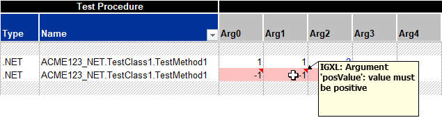

# Alert Service

For a consistent user experience, centralizing messages in a common service is helpful: a common look and feel can be warranted, and changes need to be implemented only in a single place to update the entire system.

> [!IMPORTANT]
> Alerts should be used with care to avoid overwhelming the user, and only be presented in extra-ordinary, special cases. Don't use the **Alert Service** for verbose mode logging of regular operation steps without offering a way to disable them.
>
> A test program running in production mode where everything goes according to plan should not produce any alerts!

## Info Alerts

Informative alerts are intended for messages with a positive / neutral information content. Anything relevant that should be highlighted to the user, for example a special operation mode, even if it was deliberately selected.

```cs
Services.Alert.Info("Test time profiling active");

// INFO: Test time profiling active [OnProgramStarted]
```

Info alerts are labeled with `INFO: ` and have the calling method listed at the end. Black color / regular style font is used in the OutputWindow.

> [!NOTE]
> Basic `CallerMemberName` tracing allows the retrieval of a calling method's name at zero overhead cost. More thorough stack analysis would allow showing the fully qualified name of the method and other, potentially useful information, but at a cost of ~10ms per call this was considered too expensive for broad use.

## Warning Alerts

Use warnings for non-fatal, but likely problematic or unexpected situations that can be recovered. An example would be the lack of calibration factors, so that defaults have to be assumed.

```cs
Services.Alert.Warning($"calibration file '{calFile}' not found - using defaults");

// WARNING: calibration file 'cal.json' not found - using defaults [ImportCalData]
```

Warning alerts are labeled with `WARNING: ` and have the calling method listed at the end. Dark blue color / regular style font is used in the OutputWindow.

Warnings do not trigger any other further action, like propagating the state to IG-XL, turn off any instruments, end flows or bin a device. From an IG-XL perspective, warnings are no different than info alerts.

## Error Alerts

Error alerts should be used for fatal, non-recoverable situations that disallow further, possibly dangerous execution of a test program.

In normal program runs, Error alerts are logged and then propagated to IG-XL by throwing an exception and having that propagate to the IG-XL Error service, following the recommended practice for .NET test code. IG-XL will  handle the error, and bin out devices correctly as set up. When issued during validation, the IG-XL validation service is notified, resulting in validation to fail.

In both cases, execution does not stop immediately, but is gracefully and safely terminated by IG-XL.

```cs
Services.Alert.Error($"can't apply 'UtilityBitState' to pin '{pin}'");

// ERROR: can't apply 'UtilityBitState' to pin 'AnaIn' [Apply]
```

Where needed, the type of the exception thrown can be specified, to assist users in their trouble-shooting:

```cs
Services.Alert.Error<ArgumentException>("'index' can not be negative");

// ERROR - RegisterCollection: 'index' can not be negative [this[]]
```

Error alerts are labeled with `ERROR: ` and have the calling method listed at the end. Red color / bold style font is used in the OutputWindow.

> [!Important]
> For improved readability and a consistent look and feel, enclose any mentioned objects, variables, values, ... in single quotes `'`:
>
> ```cs
> Services.Alert.Error($"can't apply 'UtilityBitState' to pin '{pin}'");
>
> Services.Alert.Warning($"calibration file '{calFile}' not found - using defaults");
> ```
>
> Since this is free text, the use of `'` single quotes can't be enforced by the method, so it'll depend on code authors to make sure this is followed.

### Context for Info / Warning / Error Alerts

AlertService uses the `CallerMemberName` feature to get context of the calling method without requiring the user to manually specify (and maintain!) the source. It works with an optional argument decorated with the `[CallerMemberName]` attribute, which the compiler automatically fills out on the caller side. Compared to reflection / stack exploration, this feature works very robust and is essentially free of overhead.

```cs
/// <summary>
/// Sends an Info Alert message to the selected output target(s). Use for positive / neutral information relevant to the user.
/// </summary>
/// <param name="info">The Info Alert message.</param>
/// <param name="doNotSpecify">DO NOT SPECIFY - the name of the calling method is automatically inserted by the compiler.</param>
internal static void Info(string info, [CallerMemberName] string doNotSpecify = "") {
    LogMessage(_infoTarget, GetMessage("INFO", info, doNotSpecify, false), (ColorConstants)0x7f0000, false);
}
```

> [!Warning]
> Users will need to understand they should not manually specify this information. In that case, the compiler feature would be overwritten - no big harm, but the feature is then bypassed. To avoid that, the argument is called `doNotSpecify` and a clear XML API doc info is added.

### Interactive Debug

In interactive debug scenarios, code execution is trapped at the offending statement. That way the context like local variables can be analyzed, the execution pointer dragged, EnC changes applied and execution continued:


> [!NOTE]
> This feature is pending confirmation within IG-XL. This behavior was captured in a .NET console application. The same experiment in IG-XL test code resulted in an "Unable to set the next statement. The attempt to unwind the callstack failed." error.

## Log Alerts

Log alerts are intended for rating-free output of data dumps or outputs for debug or troubleshooting purposes. The message is sent as-is, without any labels or formatting applied.

```cs
Services.Alert.Log($"{myMeasurement:}");

// outA: 1.225, 1.199, 1.203, 1,212
```

Logs to the OutputWindow can optionally be RGB color formatted and optionally use a bold style. Only in monospaced environments (text datalog window, file), text location formatting / ASCII art can be used, the OutputWindow does not support that with the proportional font that can't be changed.

## Output Targets

Three possible output targets are available for the user, where simultaneous outputs to multiple types is supported per user selection. Only the default (= minimum) outputs can not be de-selected.

| Alert Type | OutputWindow | Text/Stdf Datalog | File |
|---|---|---|---|
| Log | :lock: always | :white_square_button: optional | :white_square_button: optional |
| Info | :lock: always | :white_square_button: optional | :white_square_button: optional |
| Warning | :lock: always | :lock: always | :white_square_button: optional |
| Error | :white_square_button: optional<br>(already logged by IG-XL) | :white_square_button: optional<br>(already logged by IG-XL) | :white_square_button: optional |

> [!Important]
> For unhandled exceptions, IG-XL will always write message including calling context to the Output Window and the Text Datalog. This behavior is independent from the AlertService and can not be changed. It would therefore be redundant if the AlertService wrote the same information again. Consequently these two output targets are disabled for errors by default.
>
> This also avoids error logs to be shown even in the case of exceptions handled in a `try ... catch` clause. Users may enable these output targets if they wish additional information.

> [!NOTE]
> The service does not offer a way to globally suppress logs - the sender should instead take care about that. This design choice was made on purpose to avoid test time hits by having the logger perform potentially costly tasks to create an alert (collect data, compose output string) if it is never shown, and therefore goes unnoticed. Supporting a "disable all" could invite hidden overhead and unnoticed, but important alerts.

## Time Stamp Headers

Per system-wide setting, a time-stamp can be added in front of Info / Warning / Error Alerts. Can be overridden for individual alerts, off by default.

## Validation Fails

A dedicated approach is offered to flag fails of custom validation features to IG-XL to the system. While technically, raising an exception would also prevent validation to succeed, the IG-XL supported API `TheExec.DataManager.WriteTemplateArgumentError` allows collecting multiple validation fails and linking them to their sources. When `AlertService.Error()` is called from within validation, it will automatically use that API internally:

```cs
[TestMethod, CustomValidation]
public void TestMethod1(int posValue, double negValue) {

    if (TheExec.Flow.IsValidating) {
        if (posValue < 0) Services.Alert.Error("value must be positive", 1);
        if (negValue >= 0) Services.Alert.Error("value must be negative", 2);
        if(someOtherCondition) Services.Alert.Error("some other problem");
        return;
    }

    // some test code
}
```

IG-XL will collectively display these on the Errors sheet:


Validation is marked unsuccessful and the offered links lead directly to the offending test method arguments:



The one-based argument index is used to highlight the correct input cell on the TestInstances / FlowBasic sheet. If not provided (defaults to `0`), like when the validation check isn't tied to a single argument, the argument list cell (`Arg0`) is marked.

Validation fails are only reported to the IG-XL Validation System, but not logged anywhere else. Code execution will continue through the test of the validation sequence to allow collecting all validation errors.

## Alternatives Considered

For a more consistent log it was considered to require `context` specified for every Error / Warning / Info through a non-optional parameter. Users could specify the service, test block, test method ... to help identify the error source. Practically however, inconsistencies increased with some ambiguity specified in the message vs. in that context parameter. Since the `[CallerMemberName]` is available, it was decided that this (automatic) mechanism provides sufficient and reliable context information to alert messages.