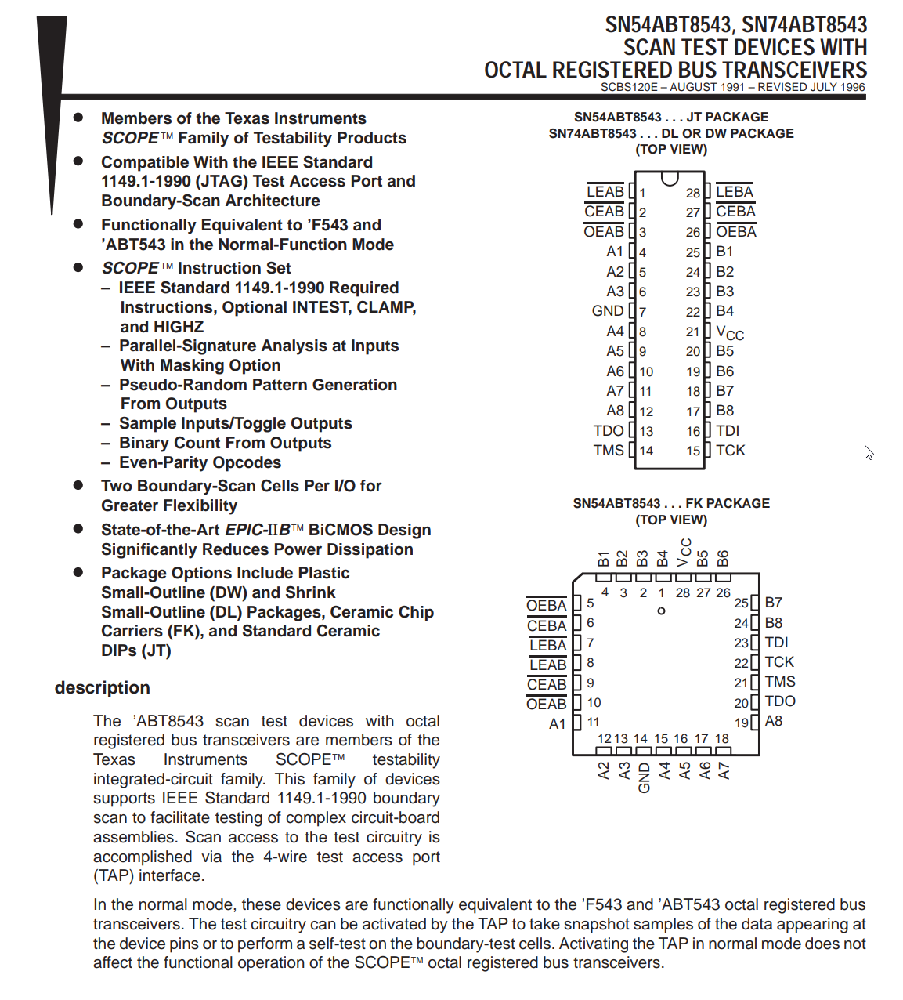
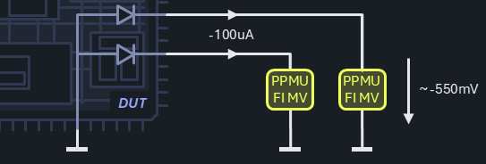

# Demo_CSRA Test List

The test methods offered as part of the **Demo_CSRA** project are implemented in a simple test program using the SN74ABT8543 octal bus transceiver device. Happy Day scenarios, where the test instances are parameterized with typical values build a reference and allow diagnosis in offline and online scenarios.

The hardware setup is compatible with the ADU training class on the UltraFLEX+ platform.

## Test Group `Continuity`

### Test `Continuity_Parametric_Parallel`

A standard implementation of a parallel parametric continuity test using the test method `Demo_CSRA.Continuity.Parametric.Parallel`. It measures the substrate diode of digital I/O pins to determine open and short fails on all pins in parallel. The expected measurement result is in the range of ~550mV.

Detailed information about the test method can be found here: *API Documentation > Demo_CSRA > Continuity > Parametric*.

| Parameter | Type | Value | Comment |
|---|---|---|---|
| `pinList` | `PinList` | `"all_pins"` | all digital I/O pins |
| `current` | `double` | `=-100*uA` | -100µA is a safe current for this device, providing reliable detection of the diode's forward voltage drop |
| `clampVoltage` | `double` | `= -1.5*V` | -1.5V provides reliable detection of open contact - absolute maximum ratings allow exceeding input voltage range of -0.5V ... +5.5V if current clamp ratings (<18/50mA) are maintained |
| `voltageRange` | `double` | `-1.5` | next fitting range to support the clamp voltage |
| `waitTime` | `double` | `0.001` | PPMU instruments typically settle well in <1ms in low capacitance load environments |
| `setup` | `string` | `""` | SetupService is not used here |

### Test `Continuity_Parametric_Serial`

- `TODO` add a link to the test method documentation here.
- `TODO` add a brief description of the test implementation.
- `TODO` add a simple block diagram with the relevant pins & instruments.

A standard implementation of a `TODO` test using the test method `Demo_CSRA.Continuity.Parametric.Serial`.

| Parameter | Type | Value | Comment |
|---|---|---|---|
| `pinList` | `PinList` | `"all_pins"` | |
| `current` | `double` | `=-100*uA` | |
| `clampVoltage` | `double` | `= -1.5*V` | |
| `voltageRange` | `double` | `-1.5` | |
| `waitTime` | `double` | `0.001` | |
| `setup` | `string` | `""` | |

### Test `Continuity_Supply_Baseline`

- `TODO` add a link to the test method documentation here.
- `TODO` add a brief description of the test implementation.
- `TODO` add a simple block diagram with the relevant pins & instruments.

A standard implementation of a `TODO` test using the test method `Demo_CSRA.Continuity.Supply.Baseline`.

| Parameter | Type | Value | Comment |
|---|---|---|---|
| `pinList` | `PinList` | `"vcc"` | |
| `forceVoltage` | `double` | `0.6` | |
| `currentRange` | `double` | `0.02` | |
| `waitTime` | `double` | `0.005` | |
| `setup` | `string` | `""` | |

## Test Group `SupplyCurrent`

### Test `SupplyCurrent_Static_Baseline`

- `TODO` add a link to the test method documentation here.
- `TODO` add a brief description of the test implementation.
- `TODO` add a simple block diagram with the relevant pins & instruments.

A standard implementation of a `TODO` test using the test method `Demo_CSRA.SupplyCurrent.Static.Baseline`.

| Parameter | Type | Value | Comment |
|---|---|---|---|
| `pinList` | `PinList` | `"vcc"` | |
| `forceValue` | `double` | `5` | |
| `measureRange` | `double` | `0.2` | |
| `clampValue` | `double` | `0.1` | |
| `waitTime` | `double` | `0.001` | |
| `setup` | `string` | `"InitIccStaticTest"` | |

### Test `SupplyCurrent_Dynamic_Baseline`

- `TODO` add a link to the test method documentation here.
- `TODO` add a brief description of the test implementation.
- `TODO` add a simple block diagram with the relevant pins & instruments.

A standard implementation of a `TODO` test using the test method `Demo_CSRA.SupplyCurrent.Dynamic.Baseline`.

| Parameter | Type | Value | Comment |
|---|---|---|---|
| `pinList` | `PinList` | `"vcc"` | |
| `forceValue` | `double` | `5` | |
| `measureRange` | `double` | `0.2` | |
| `clampValue` | `double` | `0.1` | |
| `waitTime` | `double` | `0.001` | |
| `pattern` | `Pattern` | `".\Patterns\Dyn_icc_flag.PAT"` | |
| `stops` | `int` | `2` | |
| `setup` | `string` | `""` | |

## Test Group `Resistance`

### Test `Resistance_Contact_Baseline`

- `TODO` add a link to the test method documentation here.
- `TODO` add a brief description of the test implementation.
- `TODO` add a simple block diagram with the relevant pins & instruments.

A standard implementation of a `TODO` test using the test method `Demo_CSRA.Resistance.Contact.Baseline`.

| Parameter | Type | Value | Comment |
|---|---|---|---|
| `forcePin` | `PinList` | `"all_pins"` | |
| `forceMode` | `string` | `"1"` | |
| `forceFirstValue` | `double` | `-0.01` | |
| `forceSecondValue` | `double` | `-0.02` | |
| `clampValueOfForcePin` | `double` | `-1.5` | |
| `measureFirstRange` | `double` | `3.5` | |
| `measureSecondRange` | `double` | `3.5` | |
| `waitTime` | `double` | `0.001` | |
| `setup` | `string` | `""` | |

### Test `Resistance_RdsOn_Baseline`

- `TODO` add a link to the test method documentation here.
- `TODO` add a brief description of the test implementation.
- `TODO` add a simple block diagram with the relevant pins & instruments.

A standard implementation of a `TODO` test using the test method `Demo_CSRA.Resistance.RdsOn.Baseline`.

| Parameter | Type | Value | Comment |
|---|---|---|---|
| `forcePin` | `PinList` | `"portb"` | |
| `forceMode` | `string` | `"1"` | |
| `forceValue` | `double` | `-0.04` | |
| `measureRange` | `double` | `-1.5` | |
| `waitTime` | `double` | `0.001` | |
| `labelOfStoredVoltage` | `string` | `""` | |
| `setup` | `string` | `""` | |

### Test `Resistance_RdsOn_TwoPinsOneForceOneMeasure`

- `TODO` add a link to the test method documentation here.
- `TODO` add a brief description of the test implementation.
- `TODO` add a simple block diagram with the relevant pins & instruments.

A standard implementation of a `TODO` test using the test method `Demo_CSRA.Resistance.RdsOn.TwoPinsOneForceOneMeasure`.

| Parameter | Type | Value | Comment |
|---|---|---|---|
| `forcePin` | `PinList` | `"clk_cap"` | |
| `forceMode` | `string` | `"1"` | |
| `forceValue` | `double` | `-0.001` | |
| `clampValueOfForcePin` | `double` | `6.5` | |
| `measurePin` | `PinList` | `"clk_cap"` | |
| `measureRange` | `double` | `6.5` | |
| `waitTime` | `double` | `0.001` | |
| `labelOfStoredVoltage` | `string` | `"2.5"` | |
| `setup` | `string` | `"InitClkSrcSetHi"` | |

### Test `Resistance_RdsOn_TwoPinsDeltaForceDeltaMeasure`

- `TODO` add a link to the test method documentation here.
- `TODO` add a brief description of the test implementation.
- `TODO` add a simple block diagram with the relevant pins & instruments.

A standard implementation of a `TODO` test using the test method `Demo_CSRA.Resistance.RdsOn.TwoPinsDeltaForceDeltaMeasure`.

| Parameter | Type | Value | Comment |
|---|---|---|---|
| `forcePin` | `PinList` | `"clk_cap"` | |
| `forceMode` | `string` | `"1"` | |
| `forceFirstValue` | `double` | `-0.001` | |
| `forceSecondValue` | `double` | `-0.002` | |
| `clampValueOfForcePin` | `double` | `6.5` | |
| `measurePin` | `PinList` | `"clk_cap"` | |
| `measureFirstRange` | `double` | `6.5` | |
| `measureSecondRange` | `double` | `6.5` | |
| `waitTime` | `double` | `0.001` | |
| `setup` | `string` | `"InitClkSrcSetHi"` | |

### Test `Resistance_RdsOn_ThreePinsOneForceTwoMeasure`

- `TODO` add a link to the test method documentation here.
- `TODO` add a brief description of the test implementation.
- `TODO` add a simple block diagram with the relevant pins & instruments.

A standard implementation of a `TODO` test using the test method `Demo_CSRA.Resistance.RdsOn.ThreePinsOneForceTwoMeasure`.

| Parameter | Type | Value | Comment |
|---|---|---|---|
| `forcePin` | `PinList` | `"TMS"` | |
| `forceCurrentPin` | `double` | `-5E-05` | |
| `clampValueOfForcePin` | `double` | `6.5` | |
| `measureFirstPin` | `PinList` | `"TMS"` | |
| `measureRangeFirstPin` | `double` | `6.5` | |
| `measureSecondPin` | `PinList` | `"TDI"` | |
| `measureRangeSecondPin` | `double` | `6.5` | |
| `waitTime` | `double` | `0.001` | |
| `setup` | `string` | `""` | |

### Test `Resistance_RdsOn_FourPinsTwoForceTwoMeasure`

- `TODO` add a link to the test method documentation here.
- `TODO` add a brief description of the test implementation.
- `TODO` add a simple block diagram with the relevant pins & instruments.

A standard implementation of a `TODO` test using the test method `Demo_CSRA.Resistance.RdsOn.FourPinsTwoForceTwoMeasure`.

| Parameter | Type | Value | Comment |
|---|---|---|---|
| `forceFirstPin` | `PinList` | `"TMS"` | |
| `forceValueFirstPin` | `double` | `-5E-05` | |
| `clampValueOfForceFirstPin` | `double` | `6.5` | |
| `forceSecondPin` | `PinList` | `"vcc"` | |
| `forceValueSecondPin` | `double` | `5` | |
| `clampValueOfForceSecondPin` | `double` | `0.2` | |
| `measureFirstPin` | `PinList` | `"TMS"` | |
| `measureSecondPin` | `PinList` | `"TDI"` | |
| `measureRangeFirstPin` | `double` | `6.5` | |
| `measureRangeSecondPin` | `double` | `6.5` | |
| `waitTime` | `double` | `0.001` | |
| `setup` | `string` | `""` | |

## Test Group `Leakage`

### Test `Leakage_Parallel_Baseline`

- `TODO` add a link to the test method documentation here.
- `TODO` add a brief description of the test implementation.
- `TODO` add a simple block diagram with the relevant pins & instruments.

A standard implementation of a `TODO` test using the test method `Demo_CSRA.Leakage.Parallel.Baseline`.

| Parameter | Type | Value | Comment |
|---|---|---|---|
| `pinList` | `PinList` | `"portb"` | |
| `voltage` | `double` | `=_vcc_value` | |
| `currentRange` | `double` | `0.00002` | |
| `waitTime` | `double` | `0.005` | |
| `setup` | `string` | `"InitLeakageTest"` | |

### Test `Leakage_Parallel_Preconditioning`

- `TODO` add a link to the test method documentation here.
- `TODO` add a brief description of the test implementation.
- `TODO` add a simple block diagram with the relevant pins & instruments.

A standard implementation of a `TODO` test using the test method `Demo_CSRA.Leakage.Parallel.Preconditioning`.

| Parameter | Type | Value | Comment |
|---|---|---|---|
| `pattern` | `Pattern` | `".\Patterns\init_enable_BA_hiz.PAT"` | |
| `pinList` | `PinList` | `"portb"` | |
| `voltage` | `double` | `=_vcc_value` | |
| `currentRange` | `double` | `0.00002` | |
| `waitTime` | `double` | `0.005` | |
| `setup` | `string` | `""` | |

## Test Group `Functional`

### Test `Functional_StaticPattern_Baseline`

- `TODO` add a link to the test method documentation here.
- `TODO` add a brief description of the test implementation.
- `TODO` add a simple block diagram with the relevant pins & instruments.

A standard implementation of a `TODO` test using the test method `Demo_CSRA.Functional.StaticPattern.Baseline`.

| Parameter | Type | Value | Comment |
|---|---|---|---|
| `pattern` | `Pattern` | `".\Patterns\demo_func.PAT"` | |
| `testFunctional` | `bool` | `True` | |
| `setup` | `string` | `""` | |

### Test `Functional_Read_Baseline`

- `TODO` add a link to the test method documentation here.
- `TODO` add a brief description of the test implementation.
- `TODO` add a simple block diagram with the relevant pins & instruments.

A standard implementation of a `TODO` test using the test method `Demo_CSRA.Functional.Read.Baseline`.

| Parameter | Type | Value | Comment |
|---|---|---|---|
| `pattern` | `Pattern` | `".\Patterns\demo_func.PAT"` | |
| `readPins` | `PinList` | `"a1"` | |
| `startIndex` | `int` | `8` | |
| `bitLength` | `int` | `8` | |
| `wordLength` | `int` | `8` | |
| `msbFirst` | `bool` | `False` | |
| `testFunctional` | `bool` | `True` | |
| `testValues` | `bool` | `True` | |
| `setup` | `string` | `""` | |

## Test Group `Parametric`

### Test `Parametric_PatternHandshake_Baseline`

- `TODO` add a link to the test method documentation here.
- `TODO` add a brief description of the test implementation.
- `TODO` add a simple block diagram with the relevant pins & instruments.

A standard implementation of a `TODO` test using the test method `Demo_CSRA.Parametric.PatternHandshake.Baseline`.

| Parameter | Type | Value | Comment |
|---|---|---|---|
| `pattern` | `Pattern` | `".\Patterns\demo_pattern_handshake.PAT"` | |
| `stopFlag` | `int` | `1` | |
| `numberOfStops` | `int` | `2` | |
| `executableClass` | `string` | `"Demo_CSRA.CustomCode.PatternHandshakeBaselineClass"` | |
| `testFunctional` | `bool` | `True` | |
| `setup` | `string` | `""` | |

### Test `Parametric_SingleCondition_PreConditionPattern`

- `TODO` add a link to the test method documentation here.
- `TODO` add a brief description of the test implementation.
- `TODO` add a simple block diagram with the relevant pins & instruments.

A standard implementation of a `TODO` test using the test method `Demo_CSRA.Parametric.SingleCondition.PreconditionPattern`.

| Parameter | Type | Value | Comment |
|---|---|---|---|
| `forcePinList` | `PinList` | `"portb"` | |
| `forceMode` | `string` | `"ForceCurrent"` | |
| `forceValue` | `double` | `-0.005` | |
| `clampValue` | `double` | `5` | |
| `preconditionPat` | `Pattern` | `".\Patterns\demo_init_dataflow_A_to_B.PAT"` | |
| `measureWhat` | `string` | `"Voltage"` | |
| `measureRange` | `double` | `5` | |
| `sampleSize` | `int` | `1` | |
| `measPinList` | `PinList` | `""` | |
| `waitTime` | `double` | `0.001` | |
| `setup` | `string` | `""` | |

### Test `Parametric_SingleCondition_Baseline`

- `TODO` add a link to the test method documentation here.
- `TODO` add a brief description of the test implementation.
- `TODO` add a simple block diagram with the relevant pins & instruments.

A standard implementation of a `TODO` test using the test method `Demo_CSRA.Parametric.SingleCondition.Baseline`.

| Parameter | Type | Value | Comment |
|---|---|---|---|
| `forcePinList` | `PinList` | `"portb"` | |
| `forceMode` | `string` | `"ForceCurrent"` | |
| `forceValue` | `double` | `-0.005` | |
| `clampValue` | `double` | `5` | |
| `measureWhat` | `string` | `"Voltage"` | |
| `measureRange` | `double` | `5` | |
| `sampleSize` | `int` | `1` | |
| `measPinList` | `PinList` | `""` | |
| `waitTime` | `double` | `0.001` | |
| `setup` | `string` | `"InitParametricSingleConditionBaseline"` | |

### Test `Parametric_MultiCondition_PreconditionPattern`

- `TODO` add a link to the test method documentation here.
- `TODO` add a brief description of the test implementation.
- `TODO` add a simple block diagram with the relevant pins & instruments.

A standard implementation of a `TODO` test using the test method `Demo_CSRA.Parametric.MultiCondition.PreconditionPattern`.

| Parameter | Type | Value | Comment |
|---|---|---|---|
| `forcePinList` | `PinList` | `"porta,portb"` | |
| `forceModes` | `string` | `"ForceVoltage,ForceCurrent"` | |
| `forceValues` | `string` | `"5,-0.0005"` | |
| `clampValues` | `string` | `"0.002,6.5"` | |
| `preconditionPat` | `Pattern` | `".\Patterns\init_enable_AB_low.PAT"` | |
| `measureModes` | `string` | `"Voltage"` | |
| `measureRanges` | `string` | `"5"` | |
| `sampleSizes` | `string` | `""` | |
| `measPinList` | `PinList` | `"portb"` | |
| `waitTime` | `double` | `0.001` | |
| `setup` | `string` | `""` | |

### Test `Parametric_MultiCondition_Baseline`

- `TODO` add a link to the test method documentation here.
- `TODO` add a brief description of the test implementation.
- `TODO` add a simple block diagram with the relevant pins & instruments.

A standard implementation of a `TODO` test using the test method `Demo_CSRA.Parametric.MultiCondition.Baseline`.

| Parameter | Type | Value | Comment |
|---|---|---|---|
| `forcePinList` | `PinList` | `"porta,portb"` | |
| `forceModes` | `string` | `"ForceVoltage,ForceCurrent"` | |
| `forceValues` | `string` | `"5,-0.0005"` | |
| `clampValues` | `string` | `"0.002,6.5"` | |
| `measureModes` | `string` | `"Voltage"` | |
| `measureRanges` | `string` | `"5"` | |
| `sampleSizes` | `string` | `""` | |
| `measPinList` | `PinList` | `"portb"` | |
| `waitTime` | `double` | `0.001` | |
| `setup` | `string` | `""` | |

## Test Group `Search`

### Test `Search_Functional_LinearFull`

- `TODO` add a link to the test method documentation here.
- `TODO` add a brief description of the test implementation.
- `TODO` add a simple block diagram with the relevant pins & instruments.

A standard implementation of a `TODO` test using the test method `Demo_CSRA.Search.Functional.LinearFull`.

| Parameter | Type | Value | Comment |
|---|---|---|---|
| `pattern` | `Pattern` | `".\Patterns\demo_func.PAT"` | |
| `forcePins` | `PinList` | `"vcc"` | |
| `from` | `double` | `1` | |
| `to` | `double` | `5` | |
| `count` | `int` | `20` | |
| `waitTime` | `double` | `0.001` | |
| `setup` | `string` | `""` | |

### Test `Search_Functional_LinearStop`

- `TODO` add a link to the test method documentation here.
- `TODO` add a brief description of the test implementation.
- `TODO` add a simple block diagram with the relevant pins & instruments.

A standard implementation of a `TODO` test using the test method `Demo_CSRA.Search.Functional.LinearStop`.

| Parameter | Type | Value | Comment |
|---|---|---|---|
| `pattern` | `Pattern` | `".\Patterns\demo_func.PAT"` | |
| `forcePins` | `PinList` | `"vcc"` | |
| `from` | `double` | `1` | |
| `to` | `double` | `5` | |
| `count` | `int` | `20` | |
| `waitTime` | `double` | `0.001` | |
| `setup` | `string` | `""` | |

### Test `Search_Functional_Binary`

- `TODO` add a link to the test method documentation here.
- `TODO` add a brief description of the test implementation.
- `TODO` add a simple block diagram with the relevant pins & instruments.

A standard implementation of a `TODO` test using the test method `Demo_CSRA.Search.Functional.Binary`.

| Parameter | Type | Value | Comment |
|---|---|---|---|
| `pattern` | `Pattern` | `".\Patterns\demo_func.PAT"` | |
| `forcePins` | `PinList` | `"vcc"` | |
| `from` | `double` | `1` | |
| `to` | `double` | `5` | |
| `minDelta` | `double` | `0.2` | |
| `invertedOutput` | `bool` | `False` | |
| `waitTime` | `double` | `0.001` | |
| `setup` | `string` | `""` | |

### Test `Search_Parametric_LinearFull`

- `TODO` add a link to the test method documentation here.
- `TODO` add a brief description of the test implementation.
- `TODO` add a simple block diagram with the relevant pins & instruments.

A standard implementation of a `TODO` test using the test method `Demo_CSRA.Search.Parametric.LinearFull`.

| Parameter | Type | Value | Comment |
|---|---|---|---|
| `forcePins` | `PinList` | `"b1"` | |
| `measurePin` | `PinList` | `"a1"` | |
| `from` | `double` | `0` | |
| `to` | `double` | `5` | |
| `count` | `int` | `100` | |
| `threshold` | `double` | `2` | |
| `clampCurrent` | `double` | `0.01` | |
| `waitTime` | `double` | `0.001` | |
| `setup` | `string` | `"initSearchParametric"` | |

### Test `Search_Parametric_LinearStop`

- `TODO` add a link to the test method documentation here.
- `TODO` add a brief description of the test implementation.
- `TODO` add a simple block diagram with the relevant pins & instruments.

A standard implementation of a `TODO` test using the test method `Demo_CSRA.Search.Parametric.LinearStop`.

| Parameter | Type | Value | Comment |
|---|---|---|---|
| `forcePins` | `PinList` | `"b1"` | |
| `measurePin` | `PinList` | `"a1"` | |
| `from` | `double` | `0` | |
| `to` | `double` | `5` | |
| `count` | `int` | `100` | |
| `threshold` | `double` | `2` | |
| `clampCurrent` | `double` | `0.01` | |
| `waitTime` | `double` | `0.001` | |
| `setup` | `string` | `"initSearchParametric"` | |

## Test Group `Timing`

### Test `Timing_Frequency_Baseline`

- `TODO` add a link to the test method documentation here.
- `TODO` add a brief description of the test implementation.
- `TODO` add a simple block diagram with the relevant pins & instruments.

A standard implementation of a `TODO` test using the test method `Demo_CSRA.Timing.Frequency.Baseline`.

| Parameter | Type | Value | Comment |
|---|---|---|---|
| `pattern` | `Pattern` | `".\Patterns\demo_freqCnt_clk.patx"` | |
| `pinList` | `PinList` | `"portb"` | |
| `waitTime` | `double` | `0.001` | |
| `measureWindow` | `double` | `0.05` | |
| `eventSource` | `string` | `"1"` | |
| `eventSlope` | `string` | `"0"` | |
| `setup` | `string` | `""` | |

## Test Group `DigitalTrim`

### Test `DigitalTrim_LinearStopTrip_CSRA`

- `TODO` add a link to the test method documentation here.
- `TODO` add a brief description of the test implementation.
- `TODO` add a simple block diagram with the relevant pins & instruments.

A standard implementation of a `TODO` test using the test method `Demo_CSRA.Trim.Digital.LinearStopTrip`.

| Parameter | Type | Value | Comment |
|---|---|---|---|
| `pattern` | `Pattern` | `".\Patterns\Digital_trim_fake.pat"` | |
| `from` | `int` | `0` | |
| `to` | `int` | `255` | |
| `count` | `int` | `256` | |
| `setup` | `string` | `""` | |

### Test `DigitalTrim_LinearStopTarget_CSRA`

- `TODO` add a link to the test method documentation here.
- `TODO` add a brief description of the test implementation.
- `TODO` add a simple block diagram with the relevant pins & instruments.

A standard implementation of a `TODO` test using the test method `Demo_CSRA.Trim.Digital.LinearStopTarget`.

| Parameter | Type | Value | Comment |
|---|---|---|---|
| `pattern` | `Pattern` | `".\Patterns\Digital_trim_fake_hram.pat"` | |
| `capPins` | `PinList` | `"a1"` | |
| `from` | `int` | `0` | |
| `to` | `int` | `255` | |
| `count` | `int` | `256` | |
| `target` | `int` | `128` | |
| `setup` | `string` | `""` | |

### Test `DigitalTrim_LinearFullTrip_CSRA`

- `TODO` add a link to the test method documentation here.
- `TODO` add a brief description of the test implementation.
- `TODO` add a simple block diagram with the relevant pins & instruments.

A standard implementation of a `TODO` test using the test method `Demo_CSRA.Trim.Digital.LinearFullTrip`.

| Parameter | Type | Value | Comment |
|---|---|---|---|
| `pattern` | `Pattern` | `".\Patterns\Digital_trim_fake.pat"` | |
| `from` | `int` | `0` | |
| `to` | `int` | `255` | |
| `count` | `int` | `256` | |
| `setup` | `string` | `""` | |

### Test `DigitalTrim_LinearFullTarget_CSRA`

- `TODO` add a link to the test method documentation here.
- `TODO` add a brief description of the test implementation.
- `TODO` add a simple block diagram with the relevant pins & instruments.

A standard implementation of a `TODO` test using the test method `Demo_CSRA.Trim.Digital.LinearFullTarget`.

| Parameter | Type | Value | Comment |
|---|---|---|---|
| `pattern` | `Pattern` | `".\Patterns\Digital_trim_fake_hram.pat"` | |
| `capPins` | `PinList` | `"a1"` | |
| `from` | `int` | `0` | |
| `to` | `int` | `255` | |
| `count` | `int` | `256` | |
| `target` | `int` | `128` | |
| `setup` | `string` | `""` | |

### Test `DigitalTrim_BinaryTrip_CSRA`

- `TODO` add a link to the test method documentation here.
- `TODO` add a brief description of the test implementation.
- `TODO` add a simple block diagram with the relevant pins & instruments.

A standard implementation of a `TODO` test using the test method `Demo_CSRA.Trim.Digital.BinaryTrip`.

| Parameter | Type | Value | Comment |
|---|---|---|---|
| `pattern` | `Pattern` | `".\Patterns\Digital_trim_fake.pat"` | |
| `from` | `int` | `0` | |
| `to` | `int` | `255` | |
| `minDelta` | `int` | `1` | |
| `invertedOutput` | `bool` | `0` | |
| `setup` | `string` | `""` | |

### Test `DigitalTrim_BinaryTarget_CSRA`

- `TODO` add a link to the test method documentation here.
- `TODO` add a brief description of the test implementation.
- `TODO` add a simple block diagram with the relevant pins & instruments.

A standard implementation of a `TODO` test using the test method `Demo_CSRA.Trim.Digital.BinaryTarget`.

| Parameter | Type | Value | Comment |
|---|---|---|---|
| `pattern` | `Pattern` | `".\Patterns\Digital_trim_fake_hram.pat"` | |
| `capPins` | `PinList` | `"a1"` | |
| `from` | `int` | `0` | |
| `to` | `int` | `255` | |
| `minDelta` | `int` | `1` | |
| `invertedOutput` | `bool` | `0` | |
| `target` | `int` | `128` | |
| `setup` | `string` | `""` | |
