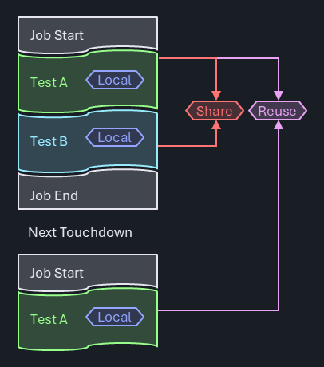
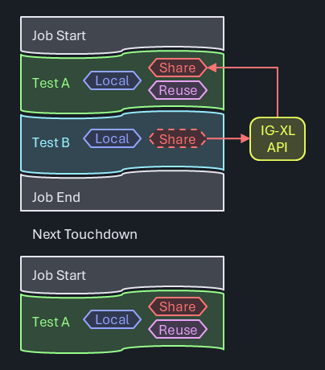
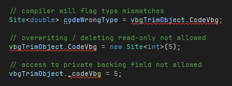

# Persistent Data Storage

Test programs frequently have a need to store data beyond the lifetime of a single test instance. Although some of that information has a test program global scope, in many cases there's a strong association between the data and a specific test method. Examples include:

- **Caching expensive (local) data:** In IG-XL, test methods are called from the flow with the test instance properties being handed as arguments. Historically, test methods didn't encourage using state, they were rather considered static, stateless methods. IG-XL is optimized for efficient data handling from its internal caches to the test method (**NOT** repetitively reading from the sheet at run time!).<br><br>However, the supported data types are limited to basic ones (`string`, `int`, `bool` and `double`). More complex information (arrays, data structures) must either be encoded in strings or referenced via a key, so that it can be looked up elsewhere. Input data that requires further processing (like generic test methods having to resolve input pin lists and query the instrument types) can't easily cache the results, since it may be called multiple times in the same flow with different arguments.<br><br>Repeated re-creation or re-evaluation directly impacts production throughput, unless users find a way to skip that in sub-sequent runs.

- **Reuse data later in the flow:** Some test concepts involve the (expensive) acquisition of device specific data once, and reuse that multiple times further along on the flow. Such data needs to be reliably re-initialized at the test program start to avoid information leakage to the next DUT. Calibration data (focus, ground) or trimming information fall into this category.

- **Aggregate data across devices:** Certain test techniques involve deliberate information leakage across devices. For instance could a part-average-testing approach dynamically adjust its limits based on the typical behavior of previous devices, so that process outliers are found sooner. Test time optimizations for trim tests could consider the results of the previous DUTs to start with the most-likely result in order to minimize the steps needed.

In all these cases, flexible data storage is required, with awareness of IG-XL events (validation, program start & end, ...) for a robust and reliable solution. 

## Concept

C#RA adheres to the principle of modularity and encapsulation. Data is stored with the minimum necessary scope and accessibility, preferably bundled into classes providing specific properties and methods to interact with it.

Test Methods are the main place to hold and manage test related data. Test blocks (stateless) receive this data as arguments, and return any results back into the test method for further processing.

Data local to the test method or test class that needs to survive beyond the test instance execution is captured in class fields, with the test class marked with the `Creation.Once` or `Creation.TestInstance` attribute. These make sure that IG-XL re-uses objects instead of creating new, resulting in persistence for any class fields. Access to such data from other test methods is made through an IG-XL API that returns a reference to an instance's test class object.

Key based data storage and retrieval is provided through a dedicated **PersistentStorageService**. Even though this is only needed in certain scenarios, an efficient & robust design is offered to provide a reliable, ready-to-use solution, saving users the effort of implementing their own (see chapter [Persistent Storage Service below](#persistent-storage-service))

> [!IMPORTANT]
> C#RA will have persistent storage that users can take advantage of, but it will not store anything in persistent storage by default, users have to opt in and should review the downsides to this storage and minimize it's use to necessities.

## Background

### VBA

In VBA, data persistence is typically achieved via module-level variables, which are the equivalent of static class fields in .NET. With scope options limited to `private` and `public` (= "global"), basic access control can be implemented. The concept of local static variables in methods may be useful, but can result in poor reusability and maintainability.



There's no limitation in types and no resulting execution time overhead for persistence. The lack of namespaces and effective encapsulation concepts results in convoluted code that violates modularity concepts and bypasses effective data & access protection.

In larger teams and programs, or in code reuse scenarios, these limitations repeatedly cause friction and scalability issues.

### .NET

The .NET languages are designed to manage large software solutions, and bring strong concepts like namespaces and the focus on object-oriented principles. In conjunction with IG-XL test programs, a few additional aspects need to be considered:

- Unlike in stand-alone tools (like .NET console apps), the concept of "running" code isn't bifold: .NET assemblies are loaded into the Excel process and "run" together with that, even before a job is started. For interactive scenarios, the debugger is "running", and may keep that running state even after the test program has completed. The question of when objects and data containers are created, preserved, reset or destructed needs consideration.
- Inter-process-communication is required in debug scenarios to synchronize data between the Excel and Debug Run Host process. 

> [!IMPORTANT]
> For normal red-button program runs, .NET test code is loaded into the Excel process and executed there. Using the VisualStudio debugger in that scenario is possible, but has limitations: dynamic code edits are not allowed in breakpoints and the Excel UI and any debug displays are non-responsive (frozen), because the debugger halts the entire process.
>
> For a truly interactive debug experience with debug displays, sheets and to support live code edits, jobs need to be started using the blue Debug-Run button. In that mode, IG-XL will execute .NET test code in a separate process (Debug Run Host or DRH). That process may be halted and even killed anytime without impacting the IG-XL runtime. Such increased flexibility however comes at the cost of overhead. The process needs to be launched, and data (all non-local variables) synchronized in both directions. IG-XL automatically takes care of that, but depending on the amount of data, this (debug only) overhead can become significant.

### Encapsulation

One of the fundamental concepts of Object Oriented Programming (OOP) is data encapsulation. It's the exact opposite of a large & global system state.

> "Encapsulation in C# is the principle of bundling data (fields) and methods that operate on that data into a single unit (class) while restricting direct access to the internal state by using access modifiers like `private` or `protected`. This ensures controlled interaction with an object's state through public methods or properties, promoting data integrity and simplifying code maintenance."

Encapsulating data in small and independent entities (classes) offering dedicated interfaces for interaction has benefits:

- **Data Protection:** fine access control.  The class designer decides which parts shall or shall not be user accessible.
- **Reuse:** goes hand-in-hand with inheritance. Multiple objects of the same type can co-exist without the risk of interference.
- **Modularity:** features can be shared easily as they are contained and have fewer (or no) dependencies.
- **Maintenance:** clear ownership and scope (of code) and a single place to modify for code changes.
- **Abstraction:** functionality is available to users without the need for detailed understanding on how the data is stored / handled internally.
- **Testability:** fewer (or no) dependencies to system state, easier to simulate corner cases.

### Persistent Test Class Objects

IG-XL itself uses a mix of programming paradigms, be that for historical reasons or for the fact that device test methodologies often follows a sequential, script-like approach. Some aspects in IG-XL are clearly object oriented (multi-site measurements, capture waveforms, ...), where others follow a more procedural style, like the concept of a Flow executing Test Instances, which call Test Methods. Finally, the use model around `DSPWave` expressions applies functional principles, where the output is a consequence of a chain of transforms on inputs without any side effects or external state involved.

.NET introduces the opportunity to better utilize object oriented tools.

In IG-XL, test methods are defined in non-static test classes. To execute a test method, an object has to be created. Static test classes are not supported as they would conflict with the concept of inheritance, which IG-XL TestMethods rely on. From IG-XL 11.00 on, users have a choice of three options for when (and how often) test class objects are created.

#### `Creation.Always` - default and only option before IG-XL 11.00

IG-XL will **create a new test class object each time** prior to calling it from the flow, objects are never stored or reused.<br><br>This model mimics the VBA approach, but does not allow for object data persistence, because once the test method has completed, the test class object (along with any local variables & class level fields) is disposed off by the garbage collector (GC). Data requiring persistence must be stored elsewhere (breaks encapsulation).

#### `Creation.Once`

IG-XL will **create a single object (aka "Singleton") of the test class** the first time it is accessed (Validation, First Run, ...) and reuse it whenever any test instance which uses the class is executed.<br><br>Data persistence is available at the class level, but data is common to all test instances using any of the test methods in the class, and shares the lifetime of the Excel process.<br><br>This option is well-suited for a collection of related test methods which benefit from a shared data set.

#### `Creation.TestInstance`

**Separate objects of the test class are created for every test instance** the first time each test instance is accessed (Validation, First Run, ...). Those objects are reused whenever their associated test instance is executed.<br><br>Non-static class level fields allow for fully encapsulated and independent data persistence for each test instance.'. Different test instance arguments can be pre-processed during validation, and the cached results are locally available for performant production runs. Data doesn't have to be sent and retrieved from somewhere, it's stored right at the place where it's created and processed. Class fields may be used for object (test instance) specific information, whereas static class fields allow sharing data across all objects.<br><br>This model works best for reusable test methods that benefit from out-sourcing some overhead or initialization to first run or validation.

### Access from Outside

The author/designer of a class retains fine control over external access. Data intended only for internal use would be defined as `private` fields and would allow no external access. Limited data access, like to only allow writing in certain ranges, or to perform calculations before reading back may go through `public` properties. Unconstrained access is possible when `public` fields are exposed directly (generally not recommended.)



Because IG-XL manages test class objects (initial creation, re-creation on assembly updates), it's important to go through an IG-XL API when accessing such objects from the outside, like from other test methods:

`Site<int> codeVbg = ((Trim)TheExec.TestProgram.TestCode.TestClassObjects.GetTestClassObject("TrimVbg", 0)).CodeVbg;`

> [!NOTE]
> The exact API language for this is still under review.

Attempts to manually cache this and avoid the IG-XL API is risky, and may result in hard-to-find errors when IG-XL re-created those objects and the cache still holds a reference to a stale object.

> [!IMPORTANT]
> This API does not open a back-door into IG-XL internals that shouldn't be accessed by users. Instead, it allows the fully OOP compliant use of test class objects. Because IG-XL creates those objects, the user doesn't have access from outside, only from inside.
>
> Not offering this interface would invite users to create their own storage, somethine likw:
>
> `public static Dictionary<string, TestCodeBase> TestCodeObjects = new();`
>
> From inside a test method, users could place a handle to itself, and manage the accessors from outside that way:
>
> `TestCodeObjects.Add(TheExec.DataManager.InstanceName, this);`
>
> This is risky as IG-XL may re-creates their test class objects without being noticed by the cache, which would then still point to the old (stale) objects. Accessing those will result in hard-to-find errors. Besides, users would redundantly store information that already exists in IG.XL. Better offer read-access to the true source and avoid compromising test solution robustness.

### Examples

The first example shows how `Creation.TestInstance` is used to cache an object of the `Pins` class for a simple continuity test:

```cs
[TestClass(Creation.TestInstance)]
public class Continuity : TestCodeBase {

    private Pins _contPins;

    [TestMethod]
    public void Simple(string pinList, double current, double voltageRange, double waitTime, string dibConfig) {
        _contPins ??= new Pins(pinList);
        Setup.ApplyLevelsTiming();
        Setup.ApplyConfig(dibConfig);
        Setup.Dc.Connect(_contPins);
        Setup.Dc.ForceI(_contPins, current, Measure.Voltage, voltageRange, current);
        Execute.ChrisSuperWait(waitTime);
        PinSite<double> meas = Acquire.Dc.ReadMeter(_contPins);
        Setup.Dc.Disconnect(_contPins);
        Datalog.TestParametric(meas, "V");
    }
}
```

The `new Pins(pinList)` constructor is only executed when the `_contPins` object is `null`, and then stored at the class level for this test instance. It goes through relatively expensive code that resolves the pin list and identifies the underlying instrument types behind every single pin. That object is used in the subsequent, instrument agnostic methods (test blocks) to perform the desired actions.

The second example presents a trim test utilizing the `Creation.Once` feature. The test method `VoltageBandgap()` sets up the device, performs a linear sweep through all trim codes and uses SiteGenerics expressions to determine the best trim code - which is stored in the class level field `_codeVbg`:

```cs
[TestClass(Creation.Once)]
public class Trim : TestCodeBase {

    private const int _defaultVbg = 7; // center value, until we know better
    private Site<int> _codeVbg = new(_defaultVbg);

    public Site<int> CodeVbg => _codeVbg;

    [ExecInterpose_OnProgramStarted]
    public void InitTrimValues() => _codeVbg.Fill(_defaultVbg);

    [TestMethod]
    public void VoltageBandgap(double targetV) {
        // connect resources
        // perform sweep
        Site<Samples<double>> cap = null; //readback all acquired strobes
        _codeVbg = cap.Select(s => {
            TerMath.Abs(s - targetV).Min(out int index);
            return index;
        });
        Datalog.TestParametric(_codeVbg);
        Datalog.TestParametric(cap.Select((m, site) => m[_codeVbg[site]]), "mV");
    }
}
```

That field is defined as `private` so it can not be directly accessed from the outside. It can however be read via the read-only `public Site<int> CodeVbg => _codeVbg;` property. Additional logic is implemented, so that the trim code is re-initialized to it's default value on every program start (method `InitTrimValues()` decorated with attribute `[ExecInterpose_OnProgramStarted]`).

Now consider a general power-up function, which needs to write the "currently best known trim code" into the DUT. When called from the flow **before** trimming was executed, the default trim value shall be used. After trimming, the actual trim code (per site) is applied. Regardless of when this method is called, it'll always access the true data source:

```cs
[TestMethod]
public void PowerUp() {
    Setup.ApplyLevelsTiming();
    var vbgTrimObject = TheProgram.TestCode().TestClassObjects.GetObject<Trim>(trimVbgTestInstance);
    Site<int> code = vbgTrimObject.CodeVbg;
    Execute.Digital.WriteRegister(registerVbg, code);
}
```

.NET inherent access control as the class author defined it is maintained. Type mismatches or attempts to bypass is flagged by the compiler:



### Persistent Storage Service

#### Problem Statement

In this project, Object-Oriented Programming (OOP) is primarily used. However, there are corner cases where it is necessary to store generic information that does not belong to any specific object. To address this, a singleton data storage solution has been implemented using a `Dictionary<string, object>` with methods for unboxing to maintain type safety.


#### Use Model

- **Initialization:** The singleton instance is created and initialized at first use.
- **Data Storage:** The `Dictionary<string, object>` is used to store data. Methods are provided for adding, retrieving, and unboxing data to specific types.
- **Access:** The singleton instance can be accessed from anywhere in the application to store or retrieve data.

#### Open Questions

Even with great care, the following downsides still remain - and have to be accepted when used:

- **Performance Overhead:** Boxing and unboxing add some performance overhead.
- **Modularity:** The use of a singleton can reduce modularity and make unit testing more challenging.
- **Scalability:** How will the data storage scale with increasing data and concurrent access?
- **Integration:** Need to create interfaces and manage integration into IG-XL ExecIp events.
- **Debuggability:** An additional level of indirection impacts debuggability, necessitating a debug-viewer for the contents.

### Alternatives considered

The following alternative was analyzed. In the overall assessment of the pros and cons they were considered less attractive than the proposed solutions for the reasons documented.

#### Use of **Global .NET Variables**

Being a little awkwardly named, **Global .NET Variables** do add persistence to objects in blue button runs involving the DRH process. Specifically, all serializable `public static` and `private static` objects are synchronized between the Excel and DRH process, so that the fundamental requirement of persistence is fulfilled.


The limitation to `static` however collides with the requirement of storing data **per test instance**. The use case of caching local data from validation or first run in a test instance would not (easily) be possible. The model is good for data that needs to be shared across a test class, providing zero overhead for read and write access.
