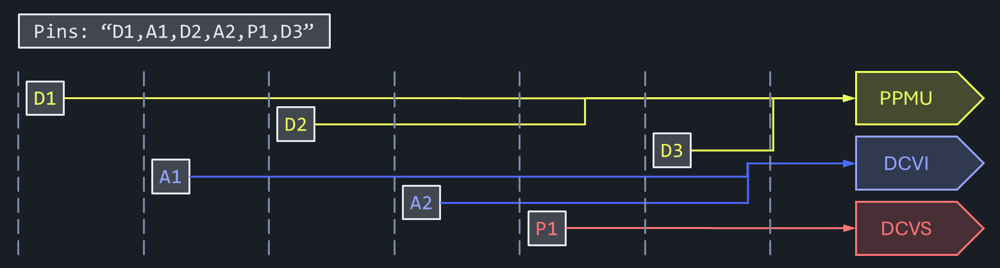
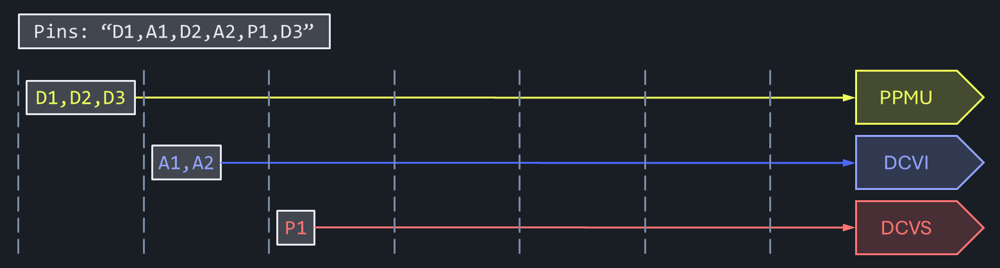

# `Pins` Type

> [!Note]
> The `Pins` type is currently being reworked. The proposed instrument & platform support changes are shown here and implemented on the legacy design, and will be ported to the new model once that is available.

The default way to handle pins, pin groups and lists of these (even nested) is by comma separated strings: these come in from the instance sheet into test methods (choice of supported types is limited here), and is consistently consumed by the PublicAPI features and instrument drivers.

Aside from the performance questions for string handling (overrated ... string manipulation has a bad reputation for being slow, but that's typically when lots of incremental changes are done in loops, but single operations on short strings won't break the bank), there's another aspect to it. For a particular setting to reach a dedicated instrument, the following steps need to be performed:

- call PublicAPI driver
- resolve (nested) pin lists, groups and aliases
- identify instrument channels according to site mask
- send data to instruments

IG-XL is pretty capable in handling these steps efficiently. Caching and optimizations under the hood allow broadcasting the data in parallel to all targeted hardware resources.

In the case of instrument-agnostic language (goal for our Test Blocks), these additional steps are required **ahead** of the PublicAPI call for efficient operation:

- resolve (nested) pin lists, groups and aliases
- determine instrument type (only for generic code)
- re-group common instrument types into sub-pin-lists

Without that, routing the calls to the specific instruments would have to be done individually. In addition to the (expensive) look-up of the instrument type at runtime, this would result in a complete serial execution:



Caching the instrument types upfront (validation, first-run) allows for optimized combination of alike pins, minimizing the overhead to the bare minimum:



## Value-Based Comparison

The `Pins` type supports value-based equality comparison. This is particularly useful when comparing pin configurations across different test scenarios or validating expected vs. actual pin sets.

- **Pin Equality:** Two `Pin` objects are considered equal if their `Name` properties are equal.
- **Pins Equality:** Two `Pins` collections are considered equal if they contain the same sequence of `Pin` objects (by name), in the same order.

This behavior is implemented by overriding `Equals` and `GetHashCode` in both `Pin` and `Pins` to be used reliably in collections like dictionaries or hash sets, and ensures consistent behavior in unit tests and validation logic.

> [!NOTE]
> The comparison is **order-sensitive**. That means [A, B] is not equal to [B, A].

This design choice aligns with the typical use cases in test development, where the pin order is relevant for calculations or datalog.

## Instrument Families

How do we find out which pins can be commonly talked to with the same language statement? Well, that depends ...

### Instrument Types

IG-XL itself offers a common API to different (physical) instrument types within the same family. For instance, there's a DC30, DC75, DC80, UltraVI80 for the UltraFLEX and an UltraVI264 for UltraFLEX+ all using the same language node `TheHdw.Dcvi...`. Common features that exist on all can easily be accessed with identical calls. Features unique to a specific instrument must still be available on that common node, but will produce a runtime exception if not backed up by the target instrument (like a certain voltage / current range, bleeder resistor, ...).

### Instrument Features

Within a physical instrument, multiple (logical) instruments can exist. All digital instruments for instance have a PPMU per channel in addition to the PinElectronic feature. DCVI instruments bring DiffMeter and DCTime features, which all have a separate language node. In some cases this is cross-cutting, so does PPMU features exist on digital instruments, as well those primarily serving mixed signal and RF needs. VI or VS instruments however do **NOT** have PPMUs, as their main purpose already cover this basic capability. 

Bottom line - the `Pins` class needs to handle pins that can have a different type, and each contain one or multiple features. Depending on the test code needs, users need to be able to query for either.

### Instrument Domain

A core concept of C#RA is the language grouping into functional domains. For instance are all DC related features placed within a `TheLib.Setup.Dc` language branch. That may include PPMU, DCVI or DCVS features.

The `Pins` class can provide information about supported domain(s).

## Test Method Level

For an intuitive, light-weight and clear use model. all the complications are buried inside the implementation. Because test instance parameters are limited to very basic types (`string`, `int`, `double` and `bool`), the `Pins` constructor accepts a comma-separated pin list `string` or `PinList` type:

```cs
[TestClass]
public class PinObjectPrototype : TestCodeBase {

    private Pins _pins;

    [TestMethod]
    public void TestMethod(string pinList) {
        _pins ??= new(pinList);
        TestLib.Setup.Dc.Connect(_pins);
        TestLib.Setup.Dc.ForceV(_pins, 1.0 * V);
        // more test code
    }
}
```
In combination with persistent test class objects, the `Pins` object can be created at first touch only, possibly during validation, so subsequent runs don't see an execution penalty.

Test blocks need to accept the `Pins` type as input. Possibly as an overload in addition to `string` for cases where instrument independent operation isn't needed.

## Test Block Level

Inside Test Blocks, `Pins` objects allow convenient querying for the different instrument types and features:

- `ContainsType()`, `ContainsFeature()`, `ContainsDomain()`: does the object contain any pin with the specified type, feature or domain?
- `ExtractByType()`, `ExtractByFeature()`, `ExtractByDomain()`: create a new `Pins` object with only pins of the specified type, feature or domain

This API allows for a concise syntax in generic Test Blocks:

[!code-csharp[](../../src/UT/VersionAgnostic_UT/Types_UT/Pins_Snippets_UT.cs?name=snippet-01)]

## Merging Results

IG-XL and C#RA heavily rely on pin and site agnostic interfaces. A `TheHdw.Dcvi.Pins().Meter.Read()` will return a single result containing data for all sites and all pins in the specified order. The test block `TheLib.Acquire.Dc.Measure()` does the same. The latter however will have to split the internal action into calls to the dedicated drivers for PPMU, DCVI or DCVS - each returning a separate object.

That object needs to be merged and put into the original sequence requested. The following method allows that:

- `ArrangePinSite<T>()`

## Alternatives Considered

The learning cost of a use model for pins that's different from the regular IG-XL way has been carefully considered when selecting the proposed solution.

### Option: "Hide" the Caching in a Global Service

Exposing a new use model to Test Method authors could be avoided by creating a global dictionary for all pin list strings that occur in a test program, and having their resolved resources stored in there.

Test Blocks however would need to perform this lookup before processing the individual instruments. Besides the (small) overhead, there's concern about putting this information on a global scope. Rogue Test Blocks could modify this information, potentially impacting other, unrelated areas in a test program. It would be more of a procedural approach and defeat object-oriented principles.

### Option: "All-In" OOP Use model

The concept of `Pin` and `Pins` objects could be further enforced by offering methods interacting with the hardware directly on the objects. Implementing dedicated interfaces for instrument types and features could resolve accessing common as well as rather specific aspects.

While appealing from a pure OOP perspective, this approach would require replacing (wrapping) the entire PublicAPI. A fundamental deviation from how things typically work (IG-XL is **NOT** purely OOP), could result in confusion in conjunction PublicAPI. If at all, such a use model should be offered natively by (a future version of) IG-XL.

## Implementation

This feature is implemented with gradually added support for instruments as they become required for the respective customer activities.

Currently, these instruments are supported:

### UltraFLEX

| Instrument (Type) | Internal Name | Config Name | Feature | Domain |
|---|---|---|---|---|
| UP1600 | Utah | `HSD-U` | Ppmu, Digital | Dc, Digital |
| UP1600+ | ? | `HSD-U` ? | Ppmu, Digital | Dc, Digital |
| HexVS | ? | `HexVS` | Dcvs | Dc |
| VSM | ? | `VSM` | Dcvs | Dc |
| UVI80 | ? | `DC-07` | Dcvi | Dc |
| SupportBoard | | `SupportBoard` | Utility | Utility |

### UltraFLEX+

| Instrument (Type) | Internal Name | Config Name | Feature | Domain |
|---|---|---|---|---|
| UP2200 | Paradise | `HSDP` | Ppmu, Digital | Dc, Digital |
| UP2200+ | ? | `HSDP` ? | Ppmu, Digital | Dc, Digital |
| UP5000-EM | Utopia | `HSDPx` | Ppmu, Digital | Dc, Digital |
| UP5000-EMX | | `HSDPx` | Ppmu, Digital | Dc, Digital |
| UVS256 | Tesla ? | `VS-800mA` | Dcvs | Dc |
| UVI264 | Raiden | `DC-8p5V90V` | Dcvi | Dc |
| UVS64 | Tesla ? | `VS-5A` | Dcvs | Dc |
| UVS64HP | Zebra | `VS-20A` | Dcvs | Dc |
| SupportBoard | DSI ? | `Support` | Utility | Utility |

## Merged Resources

Merged resources both using instrument internal (`DCVSMerged10` channel type) or external merging (`:c` syntax) are supported. The `Pins` class does not actually know about that, and can not be asked if a resource is merged or not. The IG-XL use model solely requires the leader resource being programmed, and both instrument (base-)type and features are correctly resolved.

## Shared Resources

Shared resources both across sites (`siteXX` spec in site column) and pins (`S:` syntax) are supported. The `Pins` class does not know about this and cannot be asked if a resource is shared.

## NC pins

NC return the Type `NC` and an empty list of features.

## Multiple Resources

Multiple resources connected to a pin using the `:M` syntax is not supported. That concept conflicts with the C#RA principle of instrument agnostic language. For that it is required that a pin has no features with overlapping capabilities. For instance, if a channel map pin is connected to both a Digital and a DCVI instrument, how would a `Setup.Dc.Connect()` block know which path to connect?

The `:M` concept cannot be used in C#RA enabled test programs, use dedicated pins instead (like `RST_Dig` and `RST_Dcvi`).
