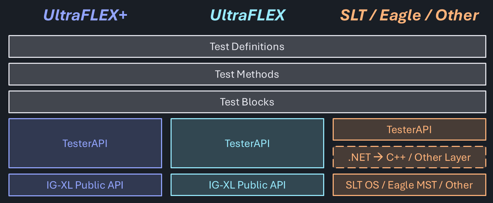
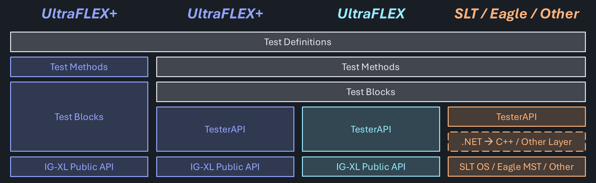

# Platform Independence

To achieve platform independence, meaning identical test coverage and results on multiple, possibly very incompatible testers, it's required to introduce commonality **somewhere**. And there are multiple places in a typical [test abstraction stack-up](test-abstraction.md) where that could be done.

## Hardware Abstraction Layer

> *"A hardware abstraction layer (HAL) is a software layer that provides a consistent interface between hardware components and higher-level software, isolating the operating system or applications from the specifics of the hardware."*

TesterAPI (FlexTest) creates an interface by abstracting the Public API on IG-XL based testers. On other testers, it is intended to achieve the same, but an additional language / runtime translation layer may be required to interface to C++ / Java based or other platforms.

Since TesterAPI offers a common interface, the layers above can be common for all platforms - the same test program can run everywhere.

## Uniform Test Methods

Enforcing a common and exclusive interface to the tester hardware poses some challenges - which may be hard to overcome:

- an identical user interface for all testers is difficult for features that only exist on some, and constrains the feature set to the common denominator. Offering any specific functionality on the top level would violate platform agnosticism, as code that uses them is now not anymore generic. Underneath though, specific features can be accessed, if they can be contained and have no implications on the user level (like parameters that need to be set).

- every additional layer introduces overhead and a level of indirection. For users who focus on a single platform only, that complexity could be a negative factor, without any apparent benefit.

Overall, test programs following that approach will have a competitive disadvantage over specifically implemented ones using the hardware and software features directly.

However, platform independence is still present at the test definition layer in this model. Platform specific implementations for the Test Method and Test Block levels may offer a common interface, but utilize hardware & software features natively.

In that scenario it's not the same test program that runs on any platform, but a test program covering the same functionality can be generated. Since they are directly comparable, the two approaches can be used to compare results and benchmark performance.

## Combining the Benefits

As it's often the case, sweet spots may exist between the extreme positions. At the cost of some redundancy, both paths can be combined, offering more flexibility.

Some testers (like UltraFlex and UltraFlex+) which share a majority of the platform specific API, it may be possible to create a common, specific implementation that handles (little) platform specifics inside. It is expected that this can be achieved without compromising performance and complexity.

As additional benefit, there would now be a way to compare and benchmark the platform independent vs. specific implementation under realistic scenarios. That would take much of the guesswork out of test time critical projects, which are not yet where they need to be. Such insight could be helpful to identify specific areas to scrutinize in a TTR activity.
