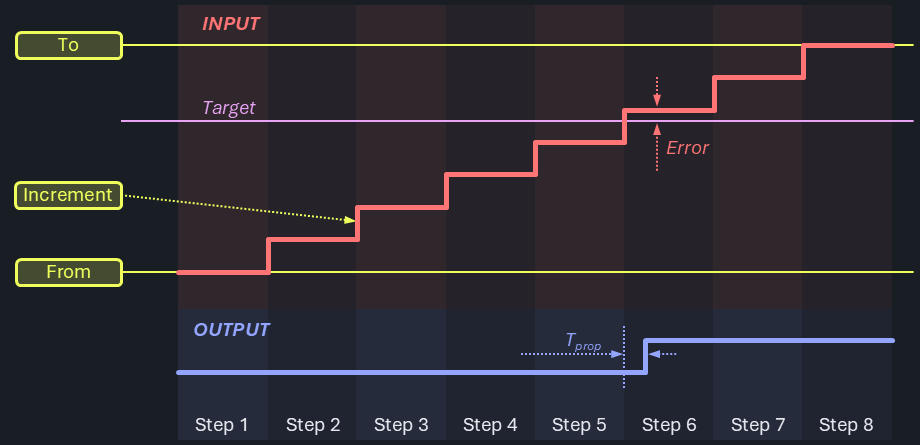
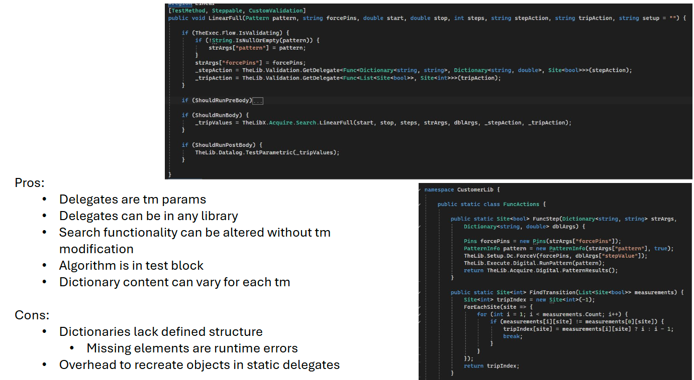
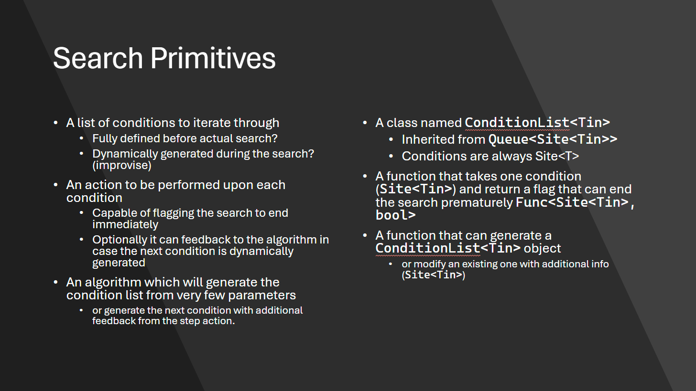
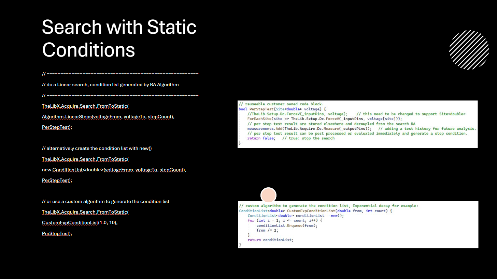
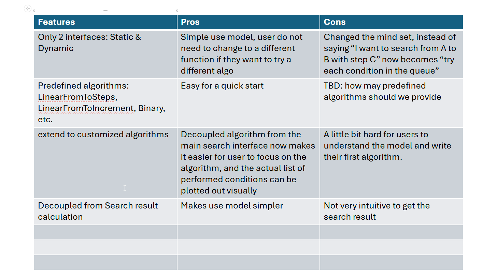

# Search & Trim Tests

Certain device parameters cannot be directly measured and instead require indirect test methods. The test conditions are applied to the device, and the resulting effects - often observed on different pins - are analyzed. The goal is to identify either a tripping point that marks a sudden change in behavior or the input condition that brings the device closest to its ideal performance. Examples include input thresholds, trim parameters, and valid ranges for supply voltages or operating frequencies.

Determining such points typically requires an iterative approach. Even with an ideal tester, the DUT (Device Under Test) itself limits how quickly tests can be executed, making these tests relatively expensive. Extensive searches are often performed during device characterization, while only the most critical ones are retained for production. Once behavior has been thoroughly verified and the production process is stable, these tests are often replaced by faster go/no-go checks. Reducing resolution (i.e., accuracy) is another way to improve test throughput.

## Flavors

There is a wide variety of parameters and methods that fall into this category. Below are a few commonly encountered ones.

### Functional vs. Parametric

Device behavior may be observed using either functional tests or parametric measurements. While the test approach is largely similar, parametric results are typically pin-based and produce numerical (integer or floating-point) values, whereas functional results are usually binary (pass/fail) patterns.

### Search vs. Trim

Trim tests are essentially a specialized form of search. For improved accuracy or performance, some devices allow post-manufacture adjustments via fuse blowing or non-volatile memory programming. A standard search strategy is used to find the optimal trim setting, after which the device is permanently altered.

### Characterization & Shmoo

There is a smooth transition between characterization and production testing, as well as between the techniques used. Characterization emphasizes accuracy, often at the cost of speed, while production testing tends to trade off resolution for throughput. Shmoo plots provide a graphical representation of search results, typically in two or three dimensions.

## Algorithms

Various search algorithms have emerged depending on DUT characteristics and tester capabilities. Each has its place and may be used interchangeably for comparison or optimization.

### LinearStop

This strategy starts at one end of the range and increments linearly until the desired condition is met. The search is then halted to avoid unnecessary steps. While simple, this approach can be slow and inefficient - especially in multi-site setups - since the full range must be traversed even when the result lies near the opposite end. It works well when the number of steps is small or when device behavior is highly non-linear or otherwise unsuitable for more advanced strategies. It can also serve as a baseline method during early device evaluation.


Since this is an interactive algorithm, it makes real-time decisions based on measurements at each step. This can introduce stalls in pipelined tester architectures.

### LinearFull

In contrast to LinearStop, this method runs the entire linear ramp regardless of when the condition is met. This can be advantageous for pipelined testers that benefit from deferred measurement processing. If the ramp dynamics are known and consistent, it’s possible to read back the full result set efficiently after ramp execution.



This method is suited to low- to medium-resolution features with manageable DUT settling times. If the settling is slow but predictable, it can be modeled and compensated for.

### BinarySearch

The [binary search algorithm](https://en.wikipedia.org/wiki/Binary_search) significantly reduces the number of steps required - from `n` to `log(n)` compared to a linear search. It is an interactive approach that divides the search space in half at each step, evaluating whether the condition lies above or below the midpoint.


However, this method can be challenging to implement across multiple sites and pins. Each channel requires independent force conditions, limiting the use of broadcast mode. Random noise or hysteresis may reduce repeatability and reproducibility.


Devices with [hysteresis](https://en.wikipedia.org/wiki/Hysteresis) may exhibit bi-modal outcomes due to the search approaching from inconsistent directions. This can be avoided by enforcing a unidirectional search.

### Polynomial and Curve Fitting Methods
When a device’s transfer function is known or can be reliably modeled, a few strategically selected measurements may suffice to estimate the entire response curve.

- **Exact Polynomial Interpolation** - this method constructs a polynomial of degree n – 1 that passes exactly through n known data points. It guarantees that all measured points are precisely matched. However, this precision comes at a cost: the resulting curve can become unstable or oscillatory, especially when using high-degree polynomials or noisy data (a phenomenon known as Runge’s phenomenon). This approach is best used when the number of data points is small and measurements are highly reliable.

- **Best-Fit Curve Approximation** - instead of requiring the curve to pass through all data points exactly, this method fits a chosen function type (e.g., linear, quadratic, exponential) to the data using regression techniques. The result is an approximate model that minimizes the overall deviation from the measured values (e.g., via least squares). While not exact at any given point, this approach is generally more stable and tolerant of noise, making it well suited for gradual, continuous behaviors.

These modeling techniques are effective in applications such as trim tests, where the device response is smooth and predictable. They are not suitable for discontinuous behaviors like functional tests or threshold searches, where abrupt transitions cannot be accurately represented by interpolation or smooth curve fitting.

### Exotic Algorithms

Some devices limit access to internal features or expose other constraints that require more specialized search strategies. When compatible with the overall design pattern, these can be integrated using C#RA’s customization features.

#### History Based Start Points

If the process is stable and well understood, starting a search from the extremes may be inefficient. Instead, the previous result(s) can serve as a statistical predictor for the current DUT. Searching in alternating directions from this point with increasing resolution can reduce total steps. However, this approach requires persistent data handling beyond a single test program run and individualized force conditions per site/pin.

#### Coarse / Fine

High-resolution ramps can be divided into coarse and fine phases. The coarse step identifies the general region, while the fine step zeroes in with greater accuracy. This is essentially a hybrid between linear and binary search strategies, where each step improves resolution by a factor (typically two).

#### Continuous Ramp

Inspired by converter testing at larger resolutions, sticking with a discrete ramp (direct association of every individual step) may become inefficient. Instead, the ramp may be provided as a truly continuous input signal. If the device's detection logic is non-discrete, its response can continuously observed and used as a trigger to detect the source condition, or captured for post-processing. Propagation delay errors - proportional to ramp speed - can be modeled and compensated.

#### FastRamp With Individual Verify

To compensate for potential inaccuracies from faster ramps (discrete or continuous), a few steps before and after the detected point can be retested for confirmation. If the threshold cannot be verified within tolerance, the device may be binned out.

#### BinLin / LinBin

BinLin is very similar to the Course / Fine strategy. The Course region typically conducts a binary search. Since things like hysteresis create improper convergence and inconsistencies across sites, it's only used to get within range. From there, the Fine region is conducted using a linear search with much fewer steps than the LinearStop or LinearFull algorithm.

It's currently unclear how LinBin would actually be used.

#### Built-In Search & Trim tests

Devices may have built-in methods to detect and determine such parameters. What they need to execute that may vary significantly and range from applying precise reference voltage from external to loading executable code into the chip memory and execute pattern to run the algorithm and capture the results.

Those tests are out of scope for this task, as they typically don't use the logic provided here. Instead, they typically use standard features available via different test blocks.

#### Asynchronous Trigger

Certain instruments allow using a hardware trigger input to determine the stop condition for a signal sourced, like DCVI with DCTime, HVD with EventStamper. To find an input threshold value in that mode, a ramp is sourced to the DUT input, while the output is connected so that a condition change either stops the source signal or records the current force value. This technique can run fully autonomously in the hardware, and the results are read back as the last forcing value from the instruments, specific to multiple sites and pins.

## Guidelines

The following guidelines have been captured in the design phase and followed during implementation:

- different search algorithms share common use model and share parameter names for same (similar) features
- execution performance is a critical goal
- functional & parametric tests share common implementation
- user interfaces are not over-burdened with superset of parameters only relevant for a single algorithm
- the risk of over-engineering is mitigated
- C# / .NET type safety is respected
- various input & output types are supported (int, double, bool and going forward - as IG-XL adds support - uint, long, ulong, ...)
## Code Structure

Consistent with the core principle of the C#RA, instrument agnostic abstraction language is offered that allows flexible re-use for the common cases and easy extension where custom aspects need to be considered. Due to the broad nature of search & trim tests, the focus is at the test block level, to be used to compose test methods suitable for a specific test. The test methods offered and implemented on the demo device follow that strategy, they may be directly reused where they fit or serve as a blueprint if different requirements exist.

The choice of this architecture was only made after controversial discussions. Eventually, it was found that the benefits outweigh the following downsides:

- algorithm encoded in test blocks, so test methods will have to select one
- test methods provided and shipped with C#RA are likely not "ready-to-use" for large majority of applications
- instead, they serve as template code for "roll-your-own"
- code uses advanced C# language concepts like delegates and generics.

### Example Test Case: Parametric Threshold Search

The following test method will determine the input threshold at which the output of the device switches. It'll perform a full ramp where the device's response is captured in every step:

```cs
[TestMethod, Steppable, CustomValidation]
public void LinearFull_ReadEach(PinList inputPins, PinList outputPins, double voltageFrom, double voltageTo, int stepCount, double outputThreshold, double stepSettleTime, string setup = "") {

    if (TheExec.Flow.IsValidating) {
        _inputPins ??= new Pins(inputPins);
        _outputPins ??= new Pins(outputPins);
    }

    if (ShouldRunPreBody) {
        TheLib.Setup.LevelsAndTiming.Apply();
        Services.Setup.Apply(setup);
        TheLib.Setup.Dc.Connect(_inputPins, true);
        TheLib.Setup.Dc.Connect(_outputPins, true);
    }

    if (ShouldRunBody) {
        TheLib.Setup.Dc.ForceV(_inputPins, voltageFrom);
        TheLib.Setup.Dc.ForceHiZ(_outputPins);
        double increment = TheLibX.Acquire.Search.LinearFullFromToSteps<double>(voltageFrom, voltageTo, stepCount, ForceAndRead);
        _tripVoltage = TheLibX.Acquire.Search.LinearFullProcess(measurements, voltageFrom, increment, 0, -999, m => m > outputThreshold);
    }

    if (ShouldRunPostBody) {
        TheLib.Setup.Dc.Disconnect(_inputPins, false);
        TheLib.Setup.Dc.Disconnect(_outputPins, false);
        TheLib.Datalog.TestParametric(_tripVoltage, voltageFrom);
    }

    void ForceAndRead(double inValue) {
        TheLib.Setup.Dc.ForceV(_inputPins, inValue);
        TheHdw.SettleWait(stepSettleTime);
        measurements.Add(TheLib.Acquire.Dc.Measure(_outputPins));
    }
}
```

The `Validating`, `PreBody` and `PostBody` sections perform the normal and typical data preparation, setup, reset and datalog actions - they are not further explained here.

The `Body` section starts by preparing the instrument setups on the device's inputs and outputs. A data container `List<PinSite<double>> measurements` is prepared to hold each step's output. Then, the test block `TheLib.Acquire.Search.LinearFullSweepFromTo` performs the complete ramp sweep according to the input parameters.

The last parameter is a delegate to the method to be performed for every, which only takes the current force value as an input parameter.

Local methods have access to all local variables and class fields, which is a great benefit. The `_inputPins`, `stepSettleTime` and `measurement` container for the results don't have to be passed in as arguments, but can be directly used. This makes the concept very generic, as it avoids impacting the argument signature of the test block. That can follow a flexible design with the ramp control parameters being generic:

```cs
internal static Tin LinearFullFromToSteps<Tin>(Tin from, Tin to, int steps, Action<Tin> oneStep) {
    dynamic inValue = from;
    dynamic increment = (to - inValue) / (steps + 1);
    for (int i = 0; i < steps; i++) {
        oneStep(inValue);
        inValue += increment;
    }
    return increment;
}
```

Overloads are offered for alternative ramp definition models to take calculations off of users shoulders:

```cs
public static void LinearFullFromToInc<Tin>(Tin from, Tin to, Tin increment, Action<Tin> oneStep) {  .. }

public static void LinearFullFromIncSteps<Tin>(Tin from, Tin increment, int steps, Action<Tin> oneStep) {  .. }
```

Finally, the collected measurements are processed to find the tripping point. This is done by the `TheLib.Acquire.Search.LinearFullProcess` test block, executed as a separate step after the ramp has completed. It uses a `Func<double, bool>` delegate to describe the criteria, in this case when the `outputThreshold` is exceeded.

```cs
public static PinSite<Tin> LinearFullProcess<Tin, Tout>(List<PinSite<Tout>> measurements, Tin from, Tin increment, Tin offset, Tin notFoundResult, Func<Tout, bool> tripCriteria) {
    PinSite<int> tripIndex = measurements.First().Select(ps => -1); // Clone the structure of the first measurement
    ForEachSite(site => { // this could be done with a convoluted & unreadable LINQ statement
        for (int index = 0; index < measurements.Count; index++) {
            for (int pin = 0; pin < tripIndex.Count; pin++) {
                if (tripIndex[pin][site] == -1 && tripCriteria(measurements[index][pin][site])) tripIndex[pin][site] = index;
            }
        }
    });
    return tripIndex.Select(t => t > -1 ? (Tin)(t * (dynamic)increment + from + offset) : notFoundResult);
}
```
### Lambda expressions

Instead of a named method, lambda expressions (`inValue => ...`) may be used to pass in the code to be executed per step, following the same notation IG-XL proposed for `ForEachSite()` loops.

```cs
List<PinSite<double>> measurements = new();

//if (TheExec.Flow.IsValidating) { ... }      //if (ShouldRunPreBody) { ... }

if (ShouldRunBody) {
    TheLib.Setup.Dc.ForceV(_inputPins, voltageFrom);
    TheLib.Setup.Dc.ForceHiZ(_outputPins);
    List<PinSite<double>> measurements = new();
    double increment = TheLibX.Acquire.Search.LinearFullFromToSteps<double>(voltageFrom, voltageTo, stepCount, inValue => {
        TheLib.Setup.Dc.ForceV(_inputPins, inValue);
        TheHdw.SettleWait(stepSettleTime);
        measurements.Add(TheLib.Acquire.Dc.Measure(_outputPins));
    });
    _tripVoltage = TheLibX.Acquire.Search.LinearFullProcess(measurements, voltageFrom, increment, 0, -999, trip => trip > outputThreshold);
}

//if (ShouldRunPostBody) { ... }
```

This notation may be preferable for cases where the delegate code is not too complex or convoluted. There is a little learning curve with the lambda expressions syntax (`=>`), so that teams at the beginning of the learning curve with C# may prefer explicit methods instead.

> [!Note]
> There is no functional or performance difference between lambda expressions or named local methods. The compiler will actually turn this into the exact same IL code.

### Public Methods

Only where non-local methods are desired, the local context needs to be handed through parameters:

```cs
if (ShouldRunBody) {
    TheLib.Setup.Dc.ForceV(_inputPins, voltageFrom);
    TheLib.Setup.Dc.ForceHiZ(_outputPins);
    List<PinSite<double>> measurements = new();
    double increment = TheLib.Acquire.Search.LinearFullSweepFromTo<double>(voltageFrom, voltageTo, stepCount, inValue =>
        CentralMethodsSomewhereElse.OneStepReadCollect(_inputPins, _outputPins, inValue, stepSettleTime, measurements));
    _tripVoltage = TheLib.Acquire.Search.LinearFullProcess(measurements, voltageFrom, increment, 0, -999, m => m > outputThreshold);
}
```

### Read All Results In Once

In this example the measurements per step are only strobed, and then read back in a single shot after the ramp completes:

```cs
if (ShouldRunBody) {
    TheLib.Setup.Dc.ForceV(_inputPins, voltageFrom);
    TheLib.Setup.Dc.ForceHiZ(_outputPins);
    double increment = TheLibX.Acquire.Search.LinearFullFromToSteps<double>(voltageFrom, voltageTo, stepCount, ForceAndStrobe);
    PinSite<Samples<double>> measurements = TheLib.Acquire.Dc.ReadMeasuredSamples(_outputPins, stepCount);
    _tripVoltage = TheLibX.Acquire.Search.LinearFullProcess(measurements, voltageFrom, increment, 0, -999, trip => trip > outputThreshold);
}

void ForceAndStrobe(double inValue) {
    TheLib.Setup.Dc.ForceV(_inputPins, inValue);
    TheHdw.SettleWait(stepSettleTime);
    TheLib.Acquire.Dc.Strobe(_outputPins);
}
```

The exact same test blocks can be used to achieve this. The per-step-action performs a `Dc.Strobe` only and a dedicated statement reads the measured samples after completion. An overload is offered for the processing block to support the slightly different result object structure `PinSite<Samples<double>>`. This model is also suitable for embedded DSP processing for best performance and full backgrounding.

### LinearFull with Functional Result

```cs
if (ShouldRunBody) {
    TheLibX.Acquire.Search.LinearFullFromToInc<double>(start, stop, increment, FuncStep);
    _tripVoltage = TheLibX.Acquire.Search.LinearFullProcess(_measurementsPs, start, increment, 0, -999, trip => trip);
}

void FuncStep(double inValue) {
    TheLib.Setup.Dc.ForceV(_pins, inValue);
    TheLib.Execute.Digital.RunPattern(_pattern);
    _measurementsPs.Add(new PinSite<bool>(TheLib.Acquire.Digital.PatternResults()));
}
```

Functional test results can be handled with `bool` as the output type. Since pattern results are not per pin, `Site<bool>` may be used instead.

### LinearStop Algorithm

A different search algorithm can be applied by simply switching the test block to the `TheLib.Acquire.Search.LinearStopFromTo` block:

```cs
if (ShouldRunBody) {
    TheLib.Setup.Dc.ForceV(_inputPins, voltageFrom);
    TheLib.Setup.Dc.ForceHiZ(_outputPins);
    _tripVoltage = TheLibX.Acquire.Search.LinearStopFromToSteps<double, double>(voltageFrom, voltageTo, stepCount, 0, -999, ForceAndRead,
        m => m > outputThreshold);
}

PinSite<double> ForceAndRead(double inValue) {
    TheLib.Setup.Dc.ForceV(_inputPins, inValue);
    TheHdw.SettleWait(stepSettleTime);
    return TheLib.Acquire.Dc.Measure(_outputPins);
}
```

It follows the same use model, but instead of a separate processing step, it directly returns the result. This is a benefit of the interactive search algorithms, however at the cost of stalling the pipeline.

### BinarySearch

In the same way, a binary search can be used thought the test block `TheLib.Acquire.Search.BinarySearch`:

```cs
if (ShouldRunBody) {
    TheLib.Setup.Dc.ForceV(_inputPins, voltageFrom);
    TheLib.Setup.Dc.ForceHiZ(_outputPins);
    _tripVoltage = TheLibX.Acquire.Search.BinarySearch<double, double>(voltageFrom, voltageTo, minDelta, false, -999, ForceAndRead,
        m => m > outputThreshold);
}

PinSite<double> ForceAndRead(PinSite<double> inValue) {
    //TheLib.Setup.Dc.ForceV(_inputPins, level); // no multi-pin / multi-site flavor available yet
    TheHdw.SettleWait(stepSettleTime);
    return TheLib.Acquire.Dc.Measure(_outputPins);
}
```

### BinarySearch unidirectional:

To avoid hysteresis problems, a modified binary search concept can make sure to always approach the levels from the same direction:

```cs
if (ShouldRunBody) {
    TheLib.Setup.Dc.ForceV(_inputPins, voltageFrom);
    TheLib.Setup.Dc.ForceHiZ(_outputPins);
    _tripVoltage = TheLibX.Acquire.Search.BinarySearch<double, double>(voltageFrom, voltageTo, minDelta, false, -999, ForceAndRead,
        m => m > outputThreshold);
}

PinSite<double> ForceAndRead(PinSite<double> inValue) {
    //TheLib.Setup.Dc.ForceV(_inputPins, level); // no multi-pin / multi-site flavor available yet
    TheHdw.SettleWait(stepSettleTime);
    var meas = TheLib.Acquire.Dc.Measure(_outputPins);
    TheLib.Setup.Dc.ForceV(_inputPins, voltageFrom);
    TheHdw.SettleWait(stepSettleTime);
    return meas;
}
```

This is achieved by modifying the single step lambda expression to return back to the starting point after each measurement. The test block itself is agnostic and can be used without change.

### Trim Test using LinearFull

Again without modification, the test blocks support trim tests:

```cs
if (ShouldRunBody) {
    RegisterWrite(from);
    TheLib.Setup.Dc.ForceHiZ(_outputPins);
    TheLibX.Acquire.Search.LinearFullFromToInc<int>(from, to, 1, ForceAndRead);
    _trimCode = TheLibX.Acquire.Search.LinearFullProcess(measurements, from, 1, 0, -999, trip => trip > target);
}

void ForceAndRead(int inValue) {
    RegisterWrite(inValue);
    TheHdw.SettleWait(stepSettleTime);
    measurements.Add(TheLib.Acquire.Dc.Measure(_outputPins));
}
```
In this case the input type is `int` for the trim code. Instead of a threshold, the trip criteria is specified by the output value exceeding the trim target, but alternative concepts (last step BEFORE switch, minimum absolute deviation, ...) are possible. Where alternative strategies are required (LinearFull_ReadAll, LinearStop, BinarySearch, ...), the respective test blocks can be used instead.

## Options

Flexibiltiy is required to suit the various use cases captured for this wide range of test techniques. Test blocks are overloaded for:

- Ramp Definition
    - `from`, `increment`, `steps` - specify start point, step size and count
    - `from`, `to`, `increment` - specify start point, end point and step size
    - `from`, `to`, `steps`- specify start point, end point and step count
- Search Criteria
    - `target` - output value that should be matched closely
    - `tripCriteria` - delegate to indicate inflection point
- Results
    - `inValue` - best input for the desired output (method return)
    - `index` - ramp index for identified best input (out parameter)
    - `outValue`- actual output value for identified best input (out parameteR)

## Alternatives Considered

### Search & Trim - A Vibrant Domain

A variety of user preferences, flavors, concepts and styles exist for what is considered "the best" approach to this domain. Despite intense discussions and prototyping, it was difficult to agree on a single concept to move forward with this. Undeniably, all of the propose alternatives have other benefits and / or solve a particular aspect more elegantly. The proposal above was determined in team voting as the most reasonable compromise to move forward.

The alternative ideas are shown here to allow closing the loop on how well the chosen path turns out to be a viable solution. A implementation proceeds, regular check-steps confirm whether design choices work out. Should the chosen path run into a road-block, alternatives may be revived quickly.

#### Flat Algorithm in Test Method


This is the most straight-forward approach, showing the loop mechanics right in the test method. Users would not have to jump to different places when stepping through, everything would be very easy to follow.

Advanced code concepts like delegates and generics are avoided at the cost of specific implementations for the given task.

Especially for more complex algorithms, this approach could result in complex test methods. There's little encapsulation or reuse applied.

#### Delegates by Name



This approach may be the plan-of-record when truly generic test methods are desired, where users can flexibly select the algorithm as a test method input parameter.

The generalization comes at the cost of some overhead and limitations in typing, which may be acceptable where flexibility is required.

#### Serch by ConditionList









This approach has the benefit of strictly following a single, generic model for any search. All steps are present, which can help when a search history would need to be traced or plotted.

Some concerns were raised on the resulting code complexity oin the test blocks. Even though additional algorithms could be implemented in a very concise way, there was some learning investment for the first. Users only wishing to step through the existing code might find it challenging to understand. The generalization may result in dictionary types being a little intransparent on the meaning of their contents.

### The All-In-One Test Method

It's expected that test methods require some modifications / adjustments to the specific device in most cases. The variety of conditions and parameters is just too broad. Offering a variety of specialized test methods templates as starting point for customization is considered better than an overly generic one with significant complexity.

That doesn't get in the way of offering overlapping functionality like with a dedicated functional Vmin test method that allows choosing between linear and binary search, if there are tangible use cases and reasonable functional scope can be determined.

### Adjust

> TODO
>
> IG-XL's Adjust Service (?) offers similar services and may be used to achieve the same. It's currently not clear if and how that is an option, or if only concepts and ideas should be reused.

### Multi-Pin

The original concept envisioned a multi-pin model with single pin being only a special case. It turned out that this would heavily complicate implementation with a very questionable benefit. Independent but simultaneous searches on multiple input --> output paths within the same device are a very rare case.

It was decided to use a single-pin model for searches.

## Questions

- POP for linear full?
