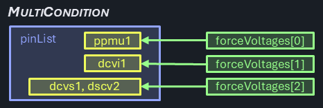
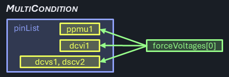
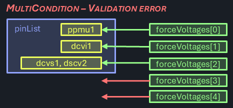
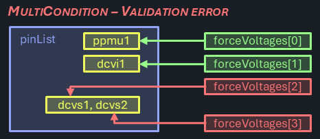
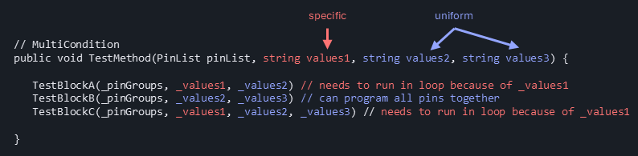

# Single- and MultiCondition

Data broadcast to tester channels is a fundamental principle in IG-XL: whether the same voltage setting needs to be sent to multiple pins, the drivers will take care of that and handle the broadcasting transparent to the user in the background. True is also: broadcast isn't an option whenever different settings are needed.

On the user interface, such different settings often result in exuberant code to determine and manage these conditions in test code plus `For` loops to apply them. Trying to be smart and optimizing the number of calls required adds even more complexity, resulting in error prone code that is hard to test and maintain.

C# Reference Architecture uses a common concept for handling single- and multi condition data across pins and pin groups, consistently implemented in areas that need this functionality. A set test blocks and other features allows for aa abstraction level similar to the single-condition case, removing friction and clutter from the user.

## PinLists and PinGroups

IG-XL supports the concept of Pins, PinGroups and PinLists. For this feature it is important to understand the differences:

- Pins are the atomic units found on the PinMap and ChanMap sheet. They typically resolve to a single tester channel for every DUT site.
- PinGroups are collections of Pins (and other pin groups, nesting is supported), also defined on the PinMap sheet. Only pins of a common type can be part of a PinGroup, which is verified during validation.
- PinLists are loose collections of Pins, PinGroups and other PinLists and typically handled in comma separated strings (CSV). Arbitrary nesting and types are supported. PinLists can either be expressed as a `string` or by using the `PinList` type (which is mostly an alias of `string`). Pin based instrument drivers typically accept pin lists as input and will resolve to hardware resources internally. PinLists are not formally defined in IG-XL or validated by default, they are rather used as literals on sheets (like TestInstance) or hardcoded in code.

> [!Important]
> This feature exclusively applies first level splitting of comma separated value lists (CSV). Each of the resulting elements is considered a separate entity (be it Pin or PinGroup) for the multi condition case. No further resolution of PinGroups is attempted. Condition counts not matching the split element count result in an error.

## Functionality

For reference, the single condition scenarios present when a single parameter is sent to a single pin:


Even when multiple pins are targeted, it's still a single condition case:


Specific conditions for different pins is the typical scenario for the multi-condition case:



All cases when the number of pins matches the number of conditions must be correctly handled by the multi-condition scenario. That includes the 1 pins / 1 condition case, even if that's close to the single pin / single condition scenario. Note that in this case the parameter is provided as a collection with a single element vs. a scalar value:


The multi-condition scenario still supports uniform parameters - if one is provided, it's shared across all pins:



Multi-condition cases, where the number of parameters provided does not match the pin group count and isn't uniform (1) are unsupported:




Even the case where the number of parameters would theoretically match the flattened pin count is not allowed. Use flat pin lists in that case instead:



## Single Condition Test Method

Let's assume this (fictitious and simplified) test method:

```cs
[TestClass(Creation.TestInstance)]
public class SingleConditionTesting : TestCodeBase {

	Pins _pins;

	[TestMethod, CustomValidation]
	public void ForceV(PinList pinList, double forceVoltage, double voltageRange, double currentRange) {

		if (TheExec.Flow.IsValidating) {
			_pins = new(pinList);
		}

		if (ShouldRunBody) {
			TheLib.Setup.Dc.ForceV(_pins, forceVoltage, voltageRange, currentRange);
		}
	}
}
```

During validation, the `Pins` object is created and persistently stored. It is used in the `Body` of the test method in the sole test block to force a voltage.

## Multi Condition Test Method

The same concept applied to a multi-condition case results in the following test method:

```cs
[TestClass(Creation.TestInstance)]
public class MultiConditionTesting : TestCodeBase {

    Pins[] _pinGroups;
    double[] _forceVoltages;
    double[] _voltageRanges;
    double[] _currentRanges;

    [TestMethod, CustomValidation]
    public void ForceV(PinList pinList, string forceVoltages, string voltageRanges, string currentRanges) {

        if (TheExec.Flow.IsValidating) {
            _pinGroups = TheLib.Validate.SplitMultiCondition(pinList, p => new Pins(p));
            _forceVoltages = TheLib.Validate.SplitMultiCondition(forceVoltages, double.Parse, _pinGroups.Length);
            _voltageRanges = TheLib.Validate.SplitMultiCondition(voltageRanges, double.Parse, _pinGroups.Length);
            _currentRanges = TheLib.Validate.SplitMultiCondition(currentRanges, double.Parse, _pinGroups.Length);
        }

        if (ShouldRunBody) {
            TheLib.Setup.Dc.ForceV(_pinGroups, _forceVoltages, _voltageRanges, _currentRanges);
        }
    }
}
```

Because the options for instance --> test method argument types are limited (arrays or lists are not available), data collections must be passed as string. Comma separated value lists (CSV) are commonly used in IG-XL for this use case, like for pin lists.

These strings must be parsed, which is done during validation time in dedicated `Validation` blocks. Besides splitting and parsing, that can also check for a matching element count (uniform ==> 1, multi-condition ==> must match reference) and raise a validation error otherwise.

The strings are converted into specifically typed arrays, while a fitting parser can be specified to support flexible types. Those arrays are stored in the test method, so that the parsing isn't affecting test time.

## Multi Condition Test Block

The test block `ForceV` called to perform the action in the `Body` section of the test method above uses the exact same use model as in the single condition case. It's offered as an overload:

```cs
public static void ForceV(Pins[] pinGroups, double[] forceVoltage, double[] voltageRange, double[] currentRange) {
	if (forceVoltage.Length == 1 && voltageRange.Length == 1 && currentRange.Length == 1) {
		TheLib.Setup.Dc.ForceV(Pins.Join(pinGroups), forceVoltage[0], voltageRange[0], currentRange[0]);
	} else {
		for (int i = 0; i < pinGroups.Length; i++) {
			TheLib.Setup.Dc.ForceV(pinGroups[i], forceVoltage.SingleOrAt(i), voltageRange.SingleOrAt(i), currentRange.SingleOrAt(i));
		}
	}
}
```

> [!Note]
> Test Blocks are exclusively called through the official path `TheLib` which goes through the versioned interfaces instead of directly referencing the implementation, even in the case where both implementations are placed right next to each other. This is done to showcase recommended practice when users copy the code for custom implementations in their own projects, where interfaces are the only accessible option.

First, it determines if all provided parameters are uniform (array length == 1). In that case it can combine the pins from all pin groups and call the single condition test bock only once. 

Otherwise, the single condition test block is called per pin group with it's associated parameters. To support a mix of uniform and specific parameters, the `.SingleOrAt()` extension method is used for a concise syntax, returning the index element (specific case) or the single element if only one exists (uniform case).

> [!Note]
> It may be surprising why a single condition case is prominently offered and specially treated here - can't user simply use the single-condition flavor of the test block instead?
>
> Real test methods will have a series of test blocks that are required to perform a specific test, and only some of the test method's parameters may need to have specific conditions per pin. And since test blocks may not require all of the test methods parameters for functionality, it can't be determined at design time which will for a truly flexible multi-condition test method.
>
> The proposed concept buries that logic under the hood but offers optimized performance in either case. The increased design effort is covered by a standardized design pattern, that can be simply followed by test block authors.
>
> 

## Alternatives Considered

### `List<T>` or `T[]` arrays

For the resolved value collections, either `List<T>` or `T[]` arrays objects could be used.

- `List<T>` are part of GenericCollections, a powerful set of types that are prominently supported. They offer dynamic extension or shrinking at the cost of a slight performance and memory footprint overhead.
- `T[]` arrays are fixed size collections with the best performance but no (direct) support for dynamic size changes. They could be considered inferior by strong VBA veterans as that was the only choice for collections there, and may have been associated with clumsy implementations.

Since both offer the advanced collection and LINQ use model in .NET, and the benefit of dynamic resizing is not very relevant in this use case, arrays are selected.

This decision shall not be interpreted as a general preference for collection objects in the C#RA project. .NET offers a variety of collection types as part of the `System.Collection.Generic` namespace, but these are not meant as a replacement for regular arrays. The decision for the best type should be made on a case-by-case basis, the following guidelines might help:

- fast access & minimum footprint? → `T[]` arrays
- dynamic size? → `List<T>`
- fast insert/delete? → `LinkedList<T>`
- unique elements? → `HashSet<T>`, `SortedSet<T>`
- fast lookup? → `Dictionary<K, V>`, `HashSet<T>`
- FIFO? → `Queue<T>`
- LIFO? → `Stack<T>`

### Array size / general test block parameter validation

Argument bounds checking and validation is a general recommendation for good and robust software. However, the additional code executed can add significant overhead to runtime. IG-XL uses the concept of validation to perform checks on information that is static for the test program runs upfront. This is true for sheet data, config limitations and can be extended to test code by using the `[CustomValidation]` attribute. It is however an opt-in model, with a due diligence requirement for test code authors to perform checks on critical inputs. Those are not enforced or guaranteed by the system.

In favor of performant test execution, C# Reference Architecture uses extensive validation time checking in test modes and avoids additional argument checking in test blocks. Specifically, in this case, multi-condition array arguments are checked for length `==` pin group count (specific) or `== 1` (uniform) at validation time. Inside the test blocks only a check for `== 1` is required to discern the two.
