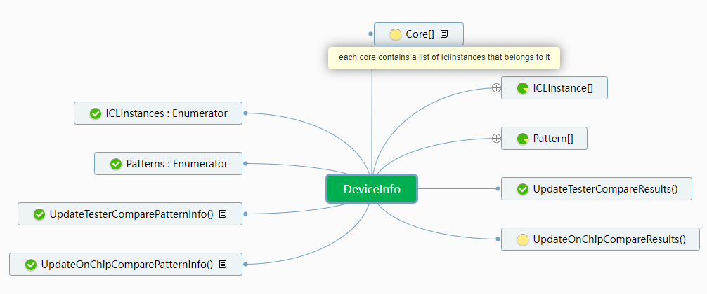
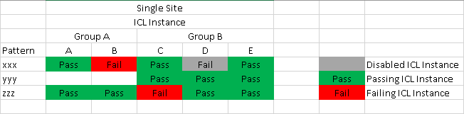
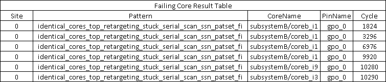
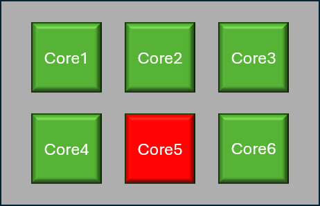

# SSN - Streaming Scan Network

For Streaming Scan Network, the __STIL__ patterns often comes in a pack of files with 5 or more types:

- Test Setup Pattern
  - used to precondition DUT into scan test mode, setup clock, etc.
  - This specific pattern is usually common to multiple SSN tests and can be executed separately
- SSN Setup Pattern
  - used to config the __SSN BUS__ by configuring each node on the bus, nodes include but not limited to :
    - __SSH__ : Streaming Scan Host
    - __SMUX__: path branching multiplexer
  - config is typically done through __iJTAG__ via __ICL__ command - Instrument Connectivity Language
  - Each __SSH__ or __SMUX__ have their individual ICL interface and can be programmed by IJTAG
  - in case of OCComp, a particular SSH can be turned off by config the __disable_contribution_bit__ of that SSH, this is crucial for fail diagnosis.
- SSN Payload Pattern
  - contains only the data on the __SSN BUS__
  - Contains both SCAN IN  and SCAN OUT pins data
  - scan data are weaved/scrambled on the entire BUS and packed back to back without clear boundary of shift or capture
  - each SSH on the bus will take data at certain cycles on certain BUS pins and reconstruct the scan load following a certain algorithm, similarly for the scan unload.
  - the algorithm to figure out a certain bit at a certain cycle on a certain pin corresponding to which __EDT__ (Embedded Deterministic Test) is available to ATE via a __csv__ file.
  - The SSN bus operation can be reconfigured from one SSN test to another by means of the SSN setup pattern. The algorithm is passed to the device by means of __iJTAG__ and to the tester via __csv__ file, therefore the __csv__ files are unique per pattern and might be uniform or different  
- SSN End Pattern
  - optionally used to reset the SSH on the active SSN BUS
  - can optionally read the status registers on each SSH
    - this is the case where OCComp test results are fetched through the __iJTAG__ port.
- Test End Pattern
  - used to conclude the test mode, restore the DUT, really case dependent.

## Flavors

### OnChipCompare (OCComp)
  
If the DUT contains multiple identical cores or EDTs, the actual data that goes into each identical EDT is also identical. Therefore, it makes sense to send only one copy of the __stimulus data__ and configure all the SSHs within the group of identical EDTs to pick the data from the same slot on the SSN BUS. Similarly, the __Expected data__ and __Mask data__ should also be identical. Instead of letting the ATE perform the comparison, the SSH (with OCComp capability) can take the Expected and Mask data and perform the comparison individually for each core. Once a mismatch is observed, the status will be recorded by __SSH__ and can be fetched later via __iJTAG__; this particular mismatch status is called a __Sticky_Bit__.
The Pass/Fail status for each core and each scan compared data (scan cell) is or-ed among all the identical EDT of the same group if they contribute.
The cumulative Pass/Fail status is then propagated on the SSN BUS and observed by the ATE on the SSN bus OUT pins
Only part of the data on SSN bus OUT pins are actual cumulative Pass/Fail status.

The mapping information for the locations of the __contribution_bit__ or __sticky_bit__ is also available in the form of a __CSV__ file, which is generated alongside the __ATP__ file from the __STIL__ file. Currently, obtaining the failed core information is a manual process. By using a code library provided on EK (originally authored by Chris Cassidy), users can parse the CSV file and determine the failed cores by providing the failed cycle numbers on the JTAG TDO pin after bursting the ssn_end pattern.

Example of a STIL file section that is used for generating the OCComp meta data(*_ssn.csv)

<details>
  <summary>STIL File Example</summary>

  ```cs
    Ann {*   Begin_Active_Ssh_Section *}
    Ann {*     instance                                            = {subsystemB/corec_i2/identical_core_rtl_tessent_ssn_scan_host_1_inst} *}
    Ann {*     icl_instance                                        = {subsystemB.corec_i2.identical_core_rtl_tessent_ssn_scan_host_1_inst} *}
    Ann {*     bus_width                                           = 4 *}
    Ann {*     packet_size                                         = 64 *}
    Ann {*     bits_per_packet                                     = 32 *}
    Ann {*     capture_packets                                     = 7 *}
    Ann {*     packets_per_capture_pulse                           = 1 *}
    Ann {*     edt_update_transition_words                         = 0 *}
    Ann {*     edt_update_launch_word                              = 0 *}
    Ann {*     scan_enable_transition_packets                      = 0 *}
    Ann {*     scan_enable_launch_packet                           = 0 *}
    Ann {*     initial_bit0_position                               = 0 *}
    Ann {*     initial_bit0_position_of_packet                     = 0 *}
    Ann {*     cycles_until_first_packet                           = 12 *}
    Ann {*     delay_cycles_in_packet                              = 0 *}
    Ann {*     offset                                              = 14 *}
    Ann {*     extra_shift_packets                                 = 0 *}
    Ann {*     delay_packets                                       = 0 *}
    Ann {*     clock_multiplier                                    = 1 *}
    Ann {*     clock_divider                                       = 1 *}
    Ann {*     on_chip_compare                                     = on *}
    Ann {*     on_chip_compare_capture_group_count                 = 2 *}
    Ann {*     on_chip_compare_capture_group                       = 2 *}
    Ann {*     on_chip_compare_capture_global_group_count          = 3 *}
    Ann {*     on_chip_compare_capture_global_group                = 2 *}
    Ann {*     min_shift_clock_low_width                           = 8 *}
    Ann {*     min_capture_clock_low_width                         = 8 *}
    Ann {*     total_shift_count                                   = 36 *}
    Ann {*     from_scan_out_bits                                  = 8 *}
    Ann {*   End_Active_Ssh_Section *}
    Ann {*   Begin_Active_Ssh_Section *}
    Ann {*     instance                                            = {subsystemB/corec_i1/identical_core_rtl_tessent_ssn_scan_host_1_inst} *}
    Ann {*     icl_instance                                        = {subsystemB.corec_i1.identical_core_rtl_tessent_ssn_scan_host_1_inst} *}
    Ann {*     bus_width                                           = 4 *}
    Ann {*     packet_size                                         = 64 *}
    Ann {*     bits_per_packet                                     = 32 *}
    Ann {*     capture_packets                                     = 7 *}
    Ann {*     packets_per_capture_pulse                           = 1 *}
    Ann {*     edt_update_transition_words                         = 0 *}
    Ann {*     edt_update_launch_word                              = 0 *}
    Ann {*     scan_enable_transition_packets                      = 0 *}
    Ann {*     scan_enable_launch_packet                           = 0 *}
    Ann {*     initial_bit0_position                               = 0 *}
    Ann {*     initial_bit0_position_of_packet                     = 0 *}
    Ann {*     cycles_until_first_packet                           = 10 *}
    Ann {*     delay_cycles_in_packet                              = 0 *}
    Ann {*     offset                                              = 12 *}
    Ann {*     extra_shift_packets                                 = 0 *}
    Ann {*     delay_packets                                       = 0 *}
    Ann {*     clock_multiplier                                    = 1 *}
    Ann {*     clock_divider                                       = 1 *}
    Ann {*     on_chip_compare                                     = on *}
    Ann {*     on_chip_compare_capture_group_count                 = 2 *}
    Ann {*     on_chip_compare_capture_group                       = 2 *}
    Ann {*     on_chip_compare_capture_global_group_count          = 3 *}
    Ann {*     on_chip_compare_capture_global_group                = 2 *}
    Ann {*     min_shift_clock_low_width                           = 8 *}
    Ann {*     min_capture_clock_low_width                         = 8 *}
    Ann {*     total_shift_count                                   = 36 *}
    Ann {*     representative_ssh                                  = {subsystemB/corec_i2/identical_core_rtl_tessent_ssn_scan_host_1_inst} *}
    Ann {*     from_scan_out_bits                                  = 8 *}
    Ann {*   End_Active_Ssh_Section *}
    Ann {*   Begin_Active_Ssh_Section *}
    Ann {*     instance                                            = {subsystemB/coreb_i1/unique_core_rtl_tessent_ssn_scan_host_1_inst} *}
    Ann {*     icl_instance                                        = {subsystemB.coreb_i1.unique_core_rtl_tessent_ssn_scan_host_1_inst} *}
    Ann {*     bus_width                                           = 4 *}
    Ann {*     packet_size                                         = 64 *}
    Ann {*     bits_per_packet                                     = 32 *}
    Ann {*     capture_packets                                     = 7 *}
    Ann {*     packets_per_capture_pulse                           = 1 *}
    Ann {*     edt_update_transition_words                         = 0 *}
    Ann {*     edt_update_launch_word                              = 0 *}
    Ann {*     scan_enable_transition_packets                      = 0 *}
    Ann {*     scan_enable_launch_packet                           = 0 *}
    Ann {*     initial_bit0_position                               = 0 *}
    Ann {*     initial_bit0_position_of_packet                     = 0 *}
    Ann {*     cycles_until_first_packet                           = 8 *}
    Ann {*     delay_cycles_in_packet                              = 8 *}
    Ann {*     offset                                              = 18 *}
    Ann {*     extra_shift_packets                                 = 0 *}
    Ann {*     delay_packets                                       = 0 *}
    Ann {*     clock_multiplier                                    = 1 *}
    Ann {*     clock_divider                                       = 1 *}
    Ann {*     on_chip_compare                                     = on *}
    Ann {*     on_chip_compare_capture_group_count                 = 1 *}
    Ann {*     on_chip_compare_capture_group                       = 1 *}
    Ann {*     on_chip_compare_capture_global_group_count          = 3 *}
    Ann {*     on_chip_compare_capture_global_group                = 1 *}
    Ann {*     min_shift_clock_low_width                           = 8 *}
    Ann {*     min_capture_clock_low_width                         = 8 *}
    Ann {*     total_shift_count                                   = 36 *}
    Ann {*     from_scan_out_bits                                  = 8 *}
    Ann {*   End_Active_Ssh_Section *}
  ```

</details>
If ALL the SSH are off then no OCComp meta data(*_ssn.csv) is created

`Ann {*     on_chip_compare                                     = off *}`

### TesterCompare (TC)

For SSN payload STIL patterns, it is almost certain that a CSV file will be generated alongside the ATP file. This CSV file contains the algorithm that describes how the pin and cycle data are rotated and mapped to each core (in IG-XL 11.0; in the future, the mapping will need to be at the SSH level rather than the core level).

In the case of grouped identical core OCComp test patterns, there is no way to identify which SSH instance in the group is causing a bit on the scan-out bus to flip. As a result, the per-core pass/fail result cannot be derived from the scan-out fail pin or cycles. In the STIL file, within the `Active_Ssh_Section`, there will be a `representative_ssh` that indicates which SSH/ICL instance is representing the group on the SSN bus if that SSH/ICL instance is sharing the pin/cycle slots with other SSH/ICL instances. In this case, only the representative SSH will be listed in the TC section `Ann {* TESSENT_PRAGMA ssn_mapping -begin/end *}` with the pin/cycle rotation information. This is useful for diagnosis because the user needs to disable all but one SSH that shares the same representative SSH.

However, for unique cores, it is more efficient to let the tester perform the comparison. In this case, IG-XL will parse the CSV file, capture the fail bits (pin/cycle), and generate the failed core information natively. The API to retrieve the result is:

```cs
var ssnResults = TheHdw.Digital.Patgen.ReadScanNetworkResults();
```

Example of stil file section that generate the TesterCompare meta data(*_ssn_mapfile.csv)

<details>
  <summary>STIL File Example</summary>

  ```cs
    Ann {* TESSENT_PRAGMA ssn_mapping -begin *}
    Ann {* TESSENT_PRAGMA ssn_mapping -datapath_id top -cycle_repetition 16 -cycle_mod 0 -design_port "gpo_0" -ssh_icl_instance subsystemB.coreb_i1.unique_core_rtl_tessent_ssn_scan_host_1_inst -core_instance "subsystemB/coreb_i1" *}
    Ann {* TESSENT_PRAGMA ssn_mapping -datapath_id top -cycle_repetition 16 -cycle_mod 0 -design_port "gpo_1" -ssh_icl_instance subsystemB.coreb_i1.unique_core_rtl_tessent_ssn_scan_host_1_inst -core_instance "subsystemB/coreb_i1" *}
    Ann {* TESSENT_PRAGMA ssn_mapping -datapath_id top -cycle_repetition 16 -cycle_mod 0 -design_port "gpo_2" -ssh_icl_instance subsystemB.coreb_i1.unique_core_rtl_tessent_ssn_scan_host_1_inst -core_instance "subsystemB/coreb_i1" *}
    Ann {* TESSENT_PRAGMA ssn_mapping -datapath_id top -cycle_repetition 16 -cycle_mod 0 -design_port "gpo_3" -ssh_icl_instance subsystemB.coreb_i1.unique_core_rtl_tessent_ssn_scan_host_1_inst -core_instance "subsystemB/coreb_i1" *}
    Ann {* TESSENT_PRAGMA ssn_mapping -datapath_id top -cycle_repetition 16 -cycle_mod 1 -design_port "gpo_0" -ssh_icl_instance subsystemB.coreb_i1.unique_core_rtl_tessent_ssn_scan_host_1_inst -core_instance "subsystemB/coreb_i1" *}
    Ann {* TESSENT_PRAGMA ssn_mapping -datapath_id top -cycle_repetition 16 -cycle_mod 1 -design_port "gpo_1" -ssh_icl_instance subsystemB.coreb_i1.unique_core_rtl_tessent_ssn_scan_host_1_inst -core_instance "subsystemB/coreb_i1" *}
    Ann {* TESSENT_PRAGMA ssn_mapping -datapath_id top -cycle_repetition 16 -cycle_mod 1 -design_port "gpo_2" -ssh_icl_instance subsystemB.coreb_i1.unique_core_rtl_tessent_ssn_scan_host_1_inst -core_instance "subsystemB/coreb_i1" *}
    Ann {* TESSENT_PRAGMA ssn_mapping -datapath_id top -cycle_repetition 16 -cycle_mod 1 -design_port "gpo_3" -ssh_icl_instance subsystemB.coreb_i1.unique_core_rtl_tessent_ssn_scan_host_1_inst -core_instance "subsystemB/coreb_i1" *}
    Ann {* TESSENT_PRAGMA ssn_mapping -datapath_id top -cycle_repetition 16 -cycle_mod 2 -design_port "gpo_0" -ssh_icl_instance subsystemB.corec_i2.identical_core_rtl_tessent_ssn_scan_host_1_inst -core_instance "subsystemB/corec_i2" *}
    Ann {* TESSENT_PRAGMA ssn_mapping -datapath_id top -cycle_repetition 16 -cycle_mod 2 -design_port "gpo_1" -ssh_icl_instance subsystemB.corec_i2.identical_core_rtl_tessent_ssn_scan_host_1_inst -core_instance "subsystemB/corec_i2" *}
    Ann {* TESSENT_PRAGMA ssn_mapping -datapath_id top -cycle_repetition 16 -cycle_mod 2 -design_port "gpo_2" -ssh_icl_instance subsystemB.corec_i2.identical_core_rtl_tessent_ssn_scan_host_1_inst -core_instance "subsystemB/corec_i2" *}
    Ann {* TESSENT_PRAGMA ssn_mapping -datapath_id top -cycle_repetition 16 -cycle_mod 2 -design_port "gpo_3" -ssh_icl_instance subsystemB.corec_i2.identical_core_rtl_tessent_ssn_scan_host_1_inst -core_instance "subsystemB/corec_i2" *}
    Ann {* TESSENT_PRAGMA ssn_mapping -datapath_id top -cycle_repetition 16 -cycle_mod 3 -design_port "gpo_0" -ssh_icl_instance subsystemB.corec_i2.identical_core_rtl_tessent_ssn_scan_host_1_inst -core_instance "subsystemB/corec_i2" *}
    Ann {* TESSENT_PRAGMA ssn_mapping -datapath_id top -cycle_repetition 16 -cycle_mod 3 -design_port "gpo_1" -ssh_icl_instance subsystemB.corec_i2.identical_core_rtl_tessent_ssn_scan_host_1_inst -core_instance "subsystemB/corec_i2" *}
    Ann {* TESSENT_PRAGMA ssn_mapping -datapath_id top -cycle_repetition 16 -cycle_mod 3 -design_port "gpo_2" -ssh_icl_instance subsystemB.corec_i2.identical_core_rtl_tessent_ssn_scan_host_1_inst -core_instance "subsystemB/corec_i2" *}
    Ann {* TESSENT_PRAGMA ssn_mapping -datapath_id top -cycle_repetition 16 -cycle_mod 3 -design_port "gpo_3" -ssh_icl_instance subsystemB.corec_i2.identical_core_rtl_tessent_ssn_scan_host_1_inst -core_instance "subsystemB/corec_i2" *}
    Ann {* TESSENT_PRAGMA ssn_mapping -datapath_id top -cycle_repetition 16 -cycle_mod 4 -design_port "gpo_0" -ssh_icl_instance subsystemB.corec_i2.identical_core_rtl_tessent_ssn_scan_host_1_inst -core_instance "subsystemB/corec_i2" *}
    Ann {* TESSENT_PRAGMA ssn_mapping -datapath_id top -cycle_repetition 16 -cycle_mod 4 -design_port "gpo_1" -ssh_icl_instance subsystemB.corec_i2.identical_core_rtl_tessent_ssn_scan_host_1_inst -core_instance "subsystemB/corec_i2" *}
    Ann {* TESSENT_PRAGMA ssn_mapping -datapath_id top -cycle_repetition 16 -cycle_mod 4 -design_port "gpo_2" -ssh_icl_instance subsystemB.corec_i2.identical_core_rtl_tessent_ssn_scan_host_1_inst -core_instance "subsystemB/corec_i2" *}
    Ann {* TESSENT_PRAGMA ssn_mapping -datapath_id top -cycle_repetition 16 -cycle_mod 4 -design_port "gpo_3" -ssh_icl_instance subsystemB.corec_i2.identical_core_rtl_tessent_ssn_scan_host_1_inst -core_instance "subsystemB/corec_i2" *}
    Ann {* TESSENT_PRAGMA ssn_mapping -datapath_id top -cycle_repetition 16 -cycle_mod 5 -design_port "gpo_0" -ssh_icl_instance subsystemB.corec_i2.identical_core_rtl_tessent_ssn_scan_host_1_inst -core_instance "subsystemB/corec_i2" *}
    Ann {* TESSENT_PRAGMA ssn_mapping -datapath_id top -cycle_repetition 16 -cycle_mod 5 -design_port "gpo_1" -ssh_icl_instance subsystemB.corec_i2.identical_core_rtl_tessent_ssn_scan_host_1_inst -core_instance "subsystemB/corec_i2" *}
    Ann {* TESSENT_PRAGMA ssn_mapping -datapath_id top -cycle_repetition 16 -cycle_mod 5 -design_port "gpo_2" -ssh_icl_instance subsystemB.corec_i2.identical_core_rtl_tessent_ssn_scan_host_1_inst -core_instance "subsystemB/corec_i2" *}
    Ann {* TESSENT_PRAGMA ssn_mapping -datapath_id top -cycle_repetition 16 -cycle_mod 5 -design_port "gpo_3" -ssh_icl_instance subsystemB.corec_i2.identical_core_rtl_tessent_ssn_scan_host_1_inst -core_instance "subsystemB/corec_i2" *}
    Ann {* TESSENT_PRAGMA ssn_mapping -datapath_id top -cycle_repetition 16 -cycle_mod 6 -design_port "gpo_0" -ssh_icl_instance subsystemB.corec_i2.identical_core_rtl_tessent_ssn_scan_host_1_inst -core_instance "subsystemB/corec_i2" *}
    Ann {* TESSENT_PRAGMA ssn_mapping -datapath_id top -cycle_repetition 16 -cycle_mod 6 -design_port "gpo_1" -ssh_icl_instance subsystemB.corec_i2.identical_core_rtl_tessent_ssn_scan_host_1_inst -core_instance "subsystemB/corec_i2" *}
    Ann {* TESSENT_PRAGMA ssn_mapping -datapath_id top -cycle_repetition 16 -cycle_mod 6 -design_port "gpo_2" -ssh_icl_instance subsystemB.corec_i2.identical_core_rtl_tessent_ssn_scan_host_1_inst -core_instance "subsystemB/corec_i2" *}
    Ann {* TESSENT_PRAGMA ssn_mapping -datapath_id top -cycle_repetition 16 -cycle_mod 6 -design_port "gpo_3" -ssh_icl_instance subsystemB.corec_i2.identical_core_rtl_tessent_ssn_scan_host_1_inst -core_instance "subsystemB/corec_i2" *}
    Ann {* TESSENT_PRAGMA ssn_mapping -datapath_id top -cycle_repetition 16 -cycle_mod 7 -design_port "gpo_0" -ssh_icl_instance subsystemB.corec_i2.identical_core_rtl_tessent_ssn_scan_host_1_inst -core_instance "subsystemB/corec_i2" *}
    Ann {* TESSENT_PRAGMA ssn_mapping -datapath_id top -cycle_repetition 16 -cycle_mod 7 -design_port "gpo_1" -ssh_icl_instance subsystemB.corec_i2.identical_core_rtl_tessent_ssn_scan_host_1_inst -core_instance "subsystemB/corec_i2" *}
    Ann {* TESSENT_PRAGMA ssn_mapping -datapath_id top -cycle_repetition 16 -cycle_mod 7 -design_port "gpo_2" -ssh_icl_instance subsystemB.corec_i2.identical_core_rtl_tessent_ssn_scan_host_1_inst -core_instance "subsystemB/corec_i2" *}
    Ann {* TESSENT_PRAGMA ssn_mapping -datapath_id top -cycle_repetition 16 -cycle_mod 7 -design_port "gpo_3" -ssh_icl_instance subsystemB.corec_i2.identical_core_rtl_tessent_ssn_scan_host_1_inst -core_instance "subsystemB/corec_i2" *}
    Ann {* TESSENT_PRAGMA ssn_mapping -datapath_id top -cycle_repetition 16 -cycle_mod 8 -design_port "gpo_0" -ssh_icl_instance subsystemB.corec_i2.identical_core_rtl_tessent_ssn_scan_host_1_inst -core_instance "subsystemB/corec_i2" *}
    Ann {* TESSENT_PRAGMA ssn_mapping -datapath_id top -cycle_repetition 16 -cycle_mod 8 -design_port "gpo_1" -ssh_icl_instance subsystemB.corec_i2.identical_core_rtl_tessent_ssn_scan_host_1_inst -core_instance "subsystemB/corec_i2" *}
    Ann {* TESSENT_PRAGMA ssn_mapping -datapath_id top -cycle_repetition 16 -cycle_mod 8 -design_port "gpo_2" -ssh_icl_instance subsystemB.corec_i2.identical_core_rtl_tessent_ssn_scan_host_1_inst -core_instance "subsystemB/corec_i2" *}
    Ann {* TESSENT_PRAGMA ssn_mapping -datapath_id top -cycle_repetition 16 -cycle_mod 8 -design_port "gpo_3" -ssh_icl_instance subsystemB.corec_i2.identical_core_rtl_tessent_ssn_scan_host_1_inst -core_instance "subsystemB/corec_i2" *}
    Ann {* TESSENT_PRAGMA ssn_mapping -datapath_id top -cycle_repetition 16 -cycle_mod 9 -design_port "gpo_0" -ssh_icl_instance subsystemB.corec_i2.identical_core_rtl_tessent_ssn_scan_host_1_inst -core_instance "subsystemB/corec_i2" *}
    Ann {* TESSENT_PRAGMA ssn_mapping -datapath_id top -cycle_repetition 16 -cycle_mod 9 -design_port "gpo_1" -ssh_icl_instance subsystemB.corec_i2.identical_core_rtl_tessent_ssn_scan_host_1_inst -core_instance "subsystemB/corec_i2" *}
    Ann {* TESSENT_PRAGMA ssn_mapping -datapath_id top -cycle_repetition 16 -cycle_mod 9 -design_port "gpo_2" -ssh_icl_instance subsystemB.corec_i2.identical_core_rtl_tessent_ssn_scan_host_1_inst -core_instance "subsystemB/corec_i2" *}
    Ann {* TESSENT_PRAGMA ssn_mapping -datapath_id top -cycle_repetition 16 -cycle_mod 9 -design_port "gpo_3" -ssh_icl_instance subsystemB.corec_i2.identical_core_rtl_tessent_ssn_scan_host_1_inst -core_instance "subsystemB/corec_i2" *}
    Ann {* TESSENT_PRAGMA ssn_mapping -datapath_id top -cycle_repetition 16 -cycle_mod 10 -design_port "gpo_0" -ssh_icl_instance subsystemB.coreb_i1.unique_core_rtl_tessent_ssn_scan_host_1_inst -core_instance "subsystemB/coreb_i1" *}
    Ann {* TESSENT_PRAGMA ssn_mapping -datapath_id top -cycle_repetition 16 -cycle_mod 10 -design_port "gpo_1" -ssh_icl_instance subsystemB.coreb_i1.unique_core_rtl_tessent_ssn_scan_host_1_inst -core_instance "subsystemB/coreb_i1" *}
    Ann {* TESSENT_PRAGMA ssn_mapping -datapath_id top -cycle_repetition 16 -cycle_mod 10 -design_port "gpo_2" -ssh_icl_instance subsystemB.coreb_i1.unique_core_rtl_tessent_ssn_scan_host_1_inst -core_instance "subsystemB/coreb_i1" *}
    Ann {* TESSENT_PRAGMA ssn_mapping -datapath_id top -cycle_repetition 16 -cycle_mod 10 -design_port "gpo_3" -ssh_icl_instance subsystemB.coreb_i1.unique_core_rtl_tessent_ssn_scan_host_1_inst -core_instance "subsystemB/coreb_i1" *}
    Ann {* TESSENT_PRAGMA ssn_mapping -datapath_id top -cycle_repetition 16 -cycle_mod 11 -design_port "gpo_0" -ssh_icl_instance subsystemB.coreb_i1.unique_core_rtl_tessent_ssn_scan_host_1_inst -core_instance "subsystemB/coreb_i1" *}
    Ann {* TESSENT_PRAGMA ssn_mapping -datapath_id top -cycle_repetition 16 -cycle_mod 11 -design_port "gpo_1" -ssh_icl_instance subsystemB.coreb_i1.unique_core_rtl_tessent_ssn_scan_host_1_inst -core_instance "subsystemB/coreb_i1" *}
    Ann {* TESSENT_PRAGMA ssn_mapping -datapath_id top -cycle_repetition 16 -cycle_mod 11 -design_port "gpo_2" -ssh_icl_instance subsystemB.coreb_i1.unique_core_rtl_tessent_ssn_scan_host_1_inst -core_instance "subsystemB/coreb_i1" *}
    Ann {* TESSENT_PRAGMA ssn_mapping -datapath_id top -cycle_repetition 16 -cycle_mod 11 -design_port "gpo_3" -ssh_icl_instance subsystemB.coreb_i1.unique_core_rtl_tessent_ssn_scan_host_1_inst -core_instance "subsystemB/coreb_i1" *}
    Ann {* TESSENT_PRAGMA ssn_mapping -datapath_id top -cycle_repetition 16 -cycle_mod 12 -design_port "gpo_0" -ssh_icl_instance subsystemB.coreb_i1.unique_core_rtl_tessent_ssn_scan_host_1_inst -core_instance "subsystemB/coreb_i1" *}
    Ann {* TESSENT_PRAGMA ssn_mapping -datapath_id top -cycle_repetition 16 -cycle_mod 12 -design_port "gpo_1" -ssh_icl_instance subsystemB.coreb_i1.unique_core_rtl_tessent_ssn_scan_host_1_inst -core_instance "subsystemB/coreb_i1" *}
    Ann {* TESSENT_PRAGMA ssn_mapping -datapath_id top -cycle_repetition 16 -cycle_mod 12 -design_port "gpo_2" -ssh_icl_instance subsystemB.coreb_i1.unique_core_rtl_tessent_ssn_scan_host_1_inst -core_instance "subsystemB/coreb_i1" *}
    Ann {* TESSENT_PRAGMA ssn_mapping -datapath_id top -cycle_repetition 16 -cycle_mod 12 -design_port "gpo_3" -ssh_icl_instance subsystemB.coreb_i1.unique_core_rtl_tessent_ssn_scan_host_1_inst -core_instance "subsystemB/coreb_i1" *}
    Ann {* TESSENT_PRAGMA ssn_mapping -datapath_id top -cycle_repetition 16 -cycle_mod 13 -design_port "gpo_0" -ssh_icl_instance subsystemB.coreb_i1.unique_core_rtl_tessent_ssn_scan_host_1_inst -core_instance "subsystemB/coreb_i1" *}
    Ann {* TESSENT_PRAGMA ssn_mapping -datapath_id top -cycle_repetition 16 -cycle_mod 13 -design_port "gpo_1" -ssh_icl_instance subsystemB.coreb_i1.unique_core_rtl_tessent_ssn_scan_host_1_inst -core_instance "subsystemB/coreb_i1" *}
    Ann {* TESSENT_PRAGMA ssn_mapping -datapath_id top -cycle_repetition 16 -cycle_mod 13 -design_port "gpo_2" -ssh_icl_instance subsystemB.coreb_i1.unique_core_rtl_tessent_ssn_scan_host_1_inst -core_instance "subsystemB/coreb_i1" *}
    Ann {* TESSENT_PRAGMA ssn_mapping -datapath_id top -cycle_repetition 16 -cycle_mod 13 -design_port "gpo_3" -ssh_icl_instance subsystemB.coreb_i1.unique_core_rtl_tessent_ssn_scan_host_1_inst -core_instance "subsystemB/coreb_i1" *}
    Ann {* TESSENT_PRAGMA ssn_mapping -datapath_id top -cycle_repetition 16 -cycle_mod 14 -design_port "gpo_0" -ssh_icl_instance subsystemB.coreb_i1.unique_core_rtl_tessent_ssn_scan_host_1_inst -core_instance "subsystemB/coreb_i1" *}
    Ann {* TESSENT_PRAGMA ssn_mapping -datapath_id top -cycle_repetition 16 -cycle_mod 14 -design_port "gpo_1" -ssh_icl_instance subsystemB.coreb_i1.unique_core_rtl_tessent_ssn_scan_host_1_inst -core_instance "subsystemB/coreb_i1" *}
    Ann {* TESSENT_PRAGMA ssn_mapping -datapath_id top -cycle_repetition 16 -cycle_mod 14 -design_port "gpo_2" -ssh_icl_instance subsystemB.coreb_i1.unique_core_rtl_tessent_ssn_scan_host_1_inst -core_instance "subsystemB/coreb_i1" *}
    Ann {* TESSENT_PRAGMA ssn_mapping -datapath_id top -cycle_repetition 16 -cycle_mod 14 -design_port "gpo_3" -ssh_icl_instance subsystemB.coreb_i1.unique_core_rtl_tessent_ssn_scan_host_1_inst -core_instance "subsystemB/coreb_i1" *}
    Ann {* TESSENT_PRAGMA ssn_mapping -datapath_id top -cycle_repetition 16 -cycle_mod 15 -design_port "gpo_0" -ssh_icl_instance subsystemB.coreb_i1.unique_core_rtl_tessent_ssn_scan_host_1_inst -core_instance "subsystemB/coreb_i1" *}
    Ann {* TESSENT_PRAGMA ssn_mapping -datapath_id top -cycle_repetition 16 -cycle_mod 15 -design_port "gpo_1" -ssh_icl_instance subsystemB.coreb_i1.unique_core_rtl_tessent_ssn_scan_host_1_inst -core_instance "subsystemB/coreb_i1" *}
    Ann {* TESSENT_PRAGMA ssn_mapping -datapath_id top -cycle_repetition 16 -cycle_mod 15 -design_port "gpo_2" -ssh_icl_instance subsystemB.coreb_i1.unique_core_rtl_tessent_ssn_scan_host_1_inst -core_instance "subsystemB/coreb_i1" *}
    Ann {* TESSENT_PRAGMA ssn_mapping -datapath_id top -cycle_repetition 16 -cycle_mod 15 -design_port "gpo_3" -ssh_icl_instance subsystemB.coreb_i1.unique_core_rtl_tessent_ssn_scan_host_1_inst -core_instance "subsystemB/coreb_i1" *}
    Ann {* TESSENT_PRAGMA ssn_mapping -end *}
  ```

</details>

### Combo (TC + OCComp)

From a device DFT perspective, it does not make sense to generate tests that are either OCComp only or TC only. It is possible that the device does not have any identical cores at all, in which case all patterns would be TC only. However, it is very unlikely that a device would have only identical cores, so in practice, only OCComp test patterns would rarely be provided.

This means that in a real customer project, SSN patterns are either:

- TC only, only the TesterCompare meta data(*_ssn_mapfile.csv) is created
- TC + OCComp combo, in that case 2 csv files will be created, the TesterCompare meta data(*_ssn_mapfile.csv) and the OCCComp (*_ssn.csv)

IG-XL can always parse the TC portion natively, but currently handling the OCComp we have to use the code lib discussed above.
This is the main reason we need a unified solution to cover both case in __CSRA__.

## Implementation

### Implementation steps

- Drop 1
  - implement inital support for OCComp and TC
  - OCComp CSV support only

- Drop 2
  - implement inital support for OCComp/TC combo
  - OCComp pattern Tags support
  - implement DeviceInfo class
- Drop 3

  - implement `per-chain sticky bit` requirments
  - TBD

### One super class

Similar to TheHdw, which is the portal to all tester instruments, and TheExec, which is the interface to all software controls, we propose to use one super object to handle all DUT related info so that test results can have a traceable history.
At a high level, we propose something like `DeviceInfo` as shown in below:

Essentially it is a sparse matrix that can be indexed by core/ssh and pattern:


The thought is that, during flow run we will need to update the elements by pattern index, and at the end we will need to gather pass/fail result by cores, where each __core__ is essentially a list of icl/ssh instances.

```cs
    // ssh/icl instance can be indexed by pattern or by core/icl instance
    //DeviceInfo.Pattern["identical"].IclInstance["coreb_i1"]...;  // during test, index by pattern first then by icl
    //DeviceInfo.IclInstance["coreb_i1"].Pattern["identical"]...;  // during binning, index by icl/core then by pattern
    //DeviceInfo.Pattern["identical"].IclInstance["coreb_i1"] and DeviceInfo.IclInstance["coreb_i1"].Pattern["identical"] are pointing to the same object.

    // Access per core test result example:
    foreach(var ssh in DeviceInfo.Core["SubsystemA"]) {
        //DeviceInfo.IclInstance[ssh].Results...
    }
```

- Currently(IG-XL 11.0), after each ssn pattern set burst, instead of just one pass/fail patgen result, there will be per core/ssh pass fail results returned by Tester Compare and by On-Chip Compare. Thus we need something like:

```cs
DeviceInfo.Pattern[PatSet].UpdateTesterCompareResults();  // for Tester Compare
DeviceInfo.Pattern[PatSet].UpdateOnChipCompareResults();  // for On-Chip Compare
```

![Code structure diagram showing TheDUT.Pattern[PatSetName] indexing method for accessing pattern-specific SSN configuration data](./media/ssn-pattern.png)

```cs
// after pattern burst, read the TesterCompare ssn results:
var ssnTcResults = TheHdw.Digital.Patgen.ReadScanNetworkResults();
DeviceInfo.UpdateTesterCompareResults(ssnPatternSet, ssnTcResults);
// alternatively:
DeviceInfo.Pattern[ssnPatternSet.Value].UpdateTesterCompareResults(ssnTcResults);
// code for updating OCComp test result is TBD
```

- Elements shall be able to be indexed by icl/ssh instance firstly as well:
![Architecture diagram showing TheDUT.IclInstance[SshIclName] indexing approach for accessing SSH ICL instance-specific data](./media/ssn-iclInstances.png)

- Finally, the per pattern per ssh element will have the detailed info such as contribution/sticky bits and pass/fail/masked flags.
 
- The full list of properties is __[TBD]__

| Property Name     |type| Meaning                                                         |
|-------------------|----|-----------------------------------------------------------------|
| PatternName       |string| name of pattern/set for this element                            |
| CoreName          |string| name of the core which this icl/ssh belongs to in this pattern  |
| SshIclInstanceName|string| name of the ssh/icl instance, should use ssh? TBD               |
| representative ssh|string| name of the representative ssh for this ssh, blank if this ssh is on TC |
| OCComp enabled    |bool| `true` if `on_chip_compare = on` (in stil)                      |
| ContributionPin   |string| empty string if `on_chip_compare = off`                         |
| ContributionLabel |string| empty string if `on_chip_compare = off`                         |
| ContributionOffset|string| empty string if `on_chip_compare = off`                         |
| StickyPin         |string| empty string if `on_chip_compare = off`                         |
| StickyLabel       |string| empty string if `on_chip_compare = off`                         |
| StickyOffset      |string| empty string if `on_chip_compare = off`                         |
| StickyCycle       |string| empty string if `on_chip_compare = off`                         |
| OCComp Masked     |`site<bool>`| = `true` if disable_contribution_bit is asserted |
| OCComp Failed     |`site<bool>`| = `true` if sticky_bit failed |
| TC Represented    |bool| = `true` if this ssh/icl has a representative ssh  |
| TC Masked         |`site<bool>`| = `true` if ssh/icl is masked by IG-XL (mask is at core level) |
| TC Failed         |`site<bool>`| = true if ReadScanNetwork() report failure (fail is at core level) |
| fail_cycle        || TBD                                             |
| fail_pin          || TBD                                             |

- Example:


- The object shall be initialized during validation:

```cs
// during validation, read and process the csv files
// Create an On Chip Compare object tied to the tested pattern/set
TheHdw.Digital.AddOnChipCompare(ssnPatternSet.Value);
var occPatInfo = TheHdw.Digital.OnChipCompare(ssnPatternSet.Value);

// Read the CSV files associated with the Sticky Pattern and the Contribution Pattern
occPatInfo.ReadCSV(stickyCsv);
occPatInfo.ReadCSV(contribCsv);

//Set the Contribution Pattern to track what pattern to modify during re-bursting
TheHdw.Digital.OnChipCompare(ssnPatternSet.Value).SetContributionPattern(contribPatName);
DeviceInfo.UpdateOnChipComparePatternInfo(ssnPatternSet.Value, occPatInfo);

// for Tester Compare:
var tcCores = TheHdw.Digital.ScanNetworks[ssnPatternSet.Value].CoreNames;
DeviceInfo.UpdateTesterComparePatternInfo(ssnPatternSet.Value, tcCores);
```

- The OCComp part will be changed to something similar with TC.
- The TC part may be changed after 11.0 due to need for ssh/icl level of details.

- ### Partial Good Binning

At the end of Test flow, customer would need to know the test result on a per core basis, and bin to different grade base on a rule set by customer.


```cs
// per ssh/icl pass/fail result for a pattern
foreach (var ssh in DeviceInfo.Pattern[ssnPatternSet.Value].IclInstances) {
    TheExec.Flow.TestLimit(ssh.FailedFlag, PinName: ssh.InstanceName, ForceResults: tlLimitForceResults.Flow);
}
// per device core pass/fail result for binning
foreach (var core in DeviceInfo.Cores) {
    TheExec.Flow.TestLimit(core.TestResults(), PinName: core.Name, ForceResults: tlLimitForceResults.Flow);
}
```

- ### Site Generic

Last but not least, the DeviceInfo object should do everything possible to comply to __Site Generic__. i.e. the pass/fail flag shall be `Site<bool>`, `.IsMasked` shall be `Site<bool>`... But for non-unique info like InstanceName and PatternName, they shall be READONLY strings or other generic types.

- ### Sample Code

```cs
// WORKING ZONE
```

### Independent class per Flavor

As for now this will not be implemented since we belief using one class handling all three types will be more beneficial.

## Debug Tools

### Failing Core Identification

Currently there is no good debug tools support in IG-XL for SSN. Some features are planned in the future, but it has not decided yet, which and how they would look like.
We will used CSRA to do some prototyping to bring in ideas we have in mind in order to do a proof of concept.

#### Core Status Display

The intention is to have a graphical way to show the status of each core and also allow to easily disable and enable cores.

Here are simple examples how we could show a high level summary for a single site. It is just to illustrate how the debug information could be shown, the naming of the differnt cell is not fix yet:



as well as for multi site:


There some more ideas we have discussed, but we are currently not planning to implement them. We keep them here for documentation purposes.
In addition more detailed information about failing cores could be provide in a result table:



but this should be either replace by an graphical implementation or used to provide additional data.

It would be also nice to show the core status, in this case, all cores are still enabled.



Show core status, similar to above, but now core 5 is disabled.


An alternative solution could be a debug display looking similar than the graphical results view in IG-XL.


## Reference

- When dealing with ssn, Siemens created many new concepts along with a lot of new names/acronyms. To help user read this article easier, we also prepared a [Glossary for ssn](ssn/ssn_glossary.md).

- Another interesting difference(from traditional scan pattern) is how should a ssn scan pattern be executed and why. Here is another page that may help you get an answer: [ssn TestFlow](ssn/ssn_flow.md)
