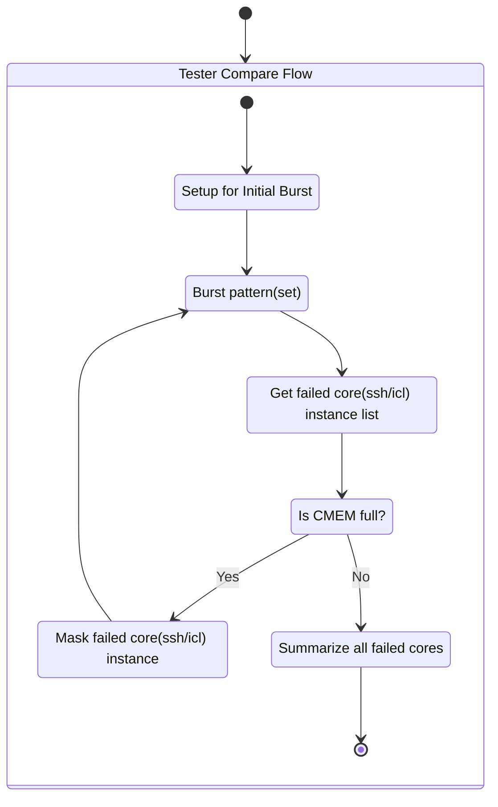
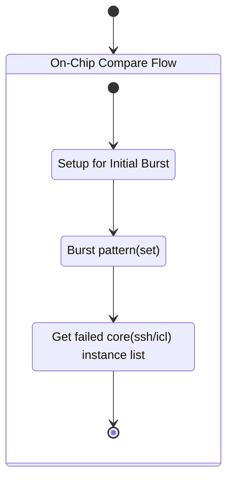
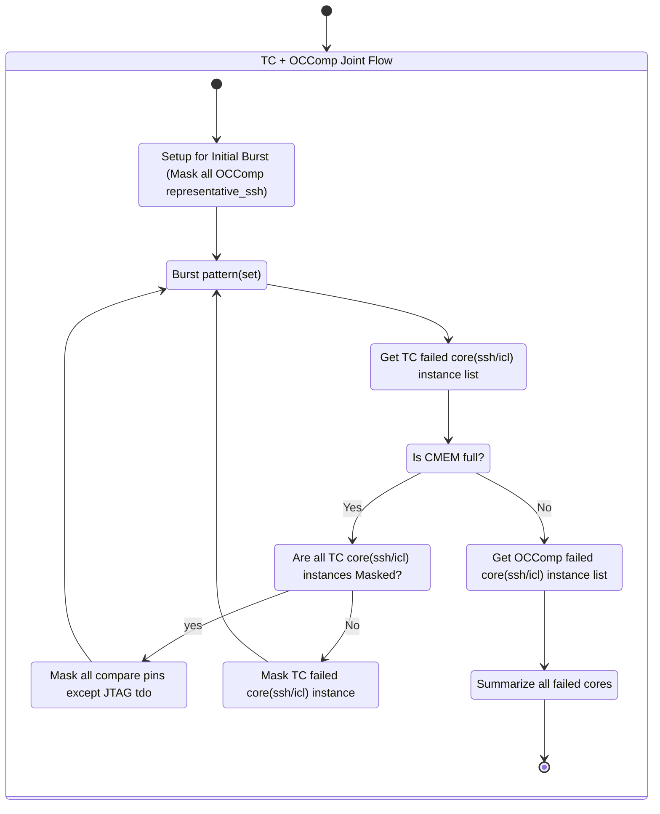
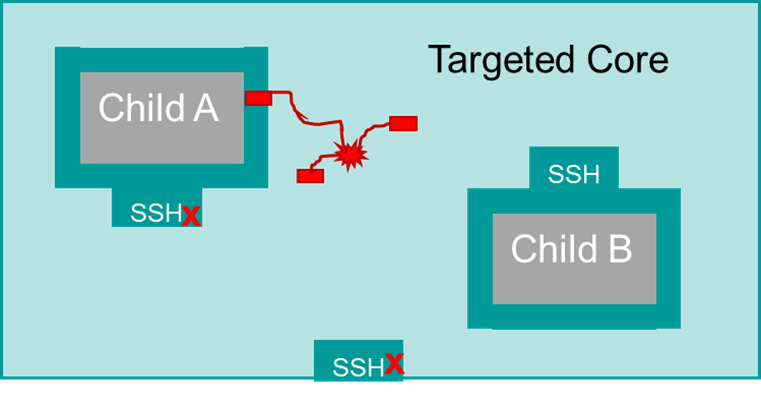
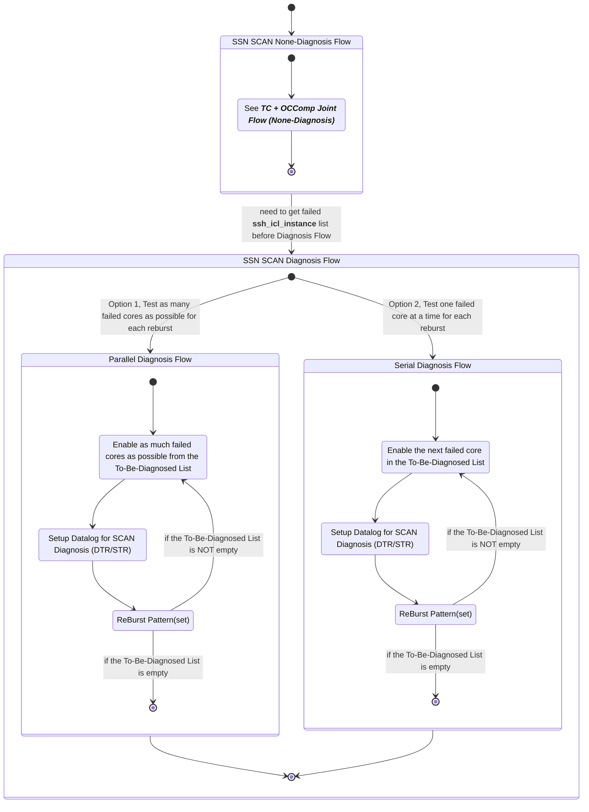

# SSN Pattern's Special TestFlow

## 1. Non-Diagnosis TestFlow if all ssh are OCComp = off (Tester Compare Flow)



### 1.1 Setup Initial Burst

```cs
// shall be encapsulated in C#RA, something like:
// TheLib.Setup.ssn.SetupCmemForInitialBurst();
TheHdw.Digital.CMEM.CentralFields = tlCMEMCaptureFields.AbsoluteCycle | tlCMEMCaptureFields.PatternName;
TheHdw.Digital.CMEM.SetCaptureConfig(-1, CmemCaptType.Fail, tlCMEMCaptureSource.PassFailData, true, false);
TheHdw.Digital.CMEM.CaptureLimitMode = tlDigitalCMEMCaptureLimitMode.Enable;
TheHdw.Digital.CMEM.CaptureLimit = maxFailsPerPin;
```

### 1.2 Burst pattern(set)

```cs
TheHdw.Patterns(ssnPatternSet).ExecuteSet(tlPatternSetResultType.Functional);
```

### 1.3 Get failed core(ssh/icl) instance list

```cs
var ssnTcResults = TheHdw.Digital.Patgen.ReadScanNetworkResults();
var failedCoreList = ssnTcResults.FailedCores;
```

### 1.4 Is CMEM full? [1.5 Mask-n-Reburst](#15-mask-failed-coresshicl-instance-and-goto-12-burst-patternset), [1.6 Conclude](#16-tc-flow-complete)

```cs

```

### 1.5 Mask failed core(ssh/icl) instance and goto [1.2 burst pattern(set)](#12-burst-patternset)

```cs
var ssnPattern = TheHdw.Digital.ScanNetworks[ssnMapfileName];
ssnPattern.CoreMasks.AddPerSite(failedCoreList);
ssnPattern.CoreMasks.Apply();
```

### 1.6 TC Flow Complete

## 2. Non-Diagnosis TestFlow if all ssh are OCComp = on (On-Chip Compare Flow)



### 2.1 Setup Initial Burst

The difference between TC and OCComp is that in OCComp user only cares about sticky_bit status. (all the sticky_bits)
So before the Initial Burst of the pattern, it is better to __Mask__ all output pins except the JTAG tdo pin.

### 2.2 Burst Pattern(set)

### 2.3 Get failed core(ssh/icl) instance list (by sticky_bit on tdo pin)

### 2.4 OCComp Flow Complete

## 3. TC + OCComp Joint Flow (None-Diagnosis)



### 3.1 Setup Initial Burst

In this case, all representative_ssh instances shall be TC masked before Initial Burst since we don't want them to consume CMEM, and we don't need them to determine any OCComp ssh-icl-instance's pass fail status.

### 3.2 Burst Pattern(set)

### 3.3 Get TC failed core(ssh/icl) instance list

### 3.4 Is CMEM full? [3.5 Mask-TC-n-Reburst](#35-mask-failed-coresshicl-instance-and-goto-32-burst-patternset), [3.6 Get OCComp failed cores](#36-get-occomp-failed-coresshicl-instance-list-by-sticky_bit-on-tdo-pin)

If CMEM is NOT full, it means that all sticky_bit fails on JTAG tdo pin are captured completely.

### 3.5 Mask failed core(ssh/icl) instance and goto [3.2 Burst pattern(set)](#32-burst-patternset)

```cs
var ssnPattern = TheHdw.Digital.ScanNetworks[ssnMapfileName];
ssnPattern.CoreMasks.AddPerSite(failedCoreList);
ssnPattern.CoreMasks.Apply();
```

in case that all TC core instances are masked and yet still the CMEM is full, it is possible that none-scan compares are eating up the CMEM. in which case we need to mask all output pins except the tdo pins just like what we do in [2.1 Setup for OCComp Initial Burst](#21-setup-initial-burst)

```cs

```

### 3.6 Get OCComp failed core(ssh/icl) instance list (by sticky_bit on tdo pin)

```cs

```

### 3.7 TC+OCComp Joint Flow complete

## 4. Diagnosis Flow

Failures may be captured in:

- Internal scan chains if target core
- Wrapper chain of child core


Failures from targeted core and child cores must be diagnosed together

And since TC + OCComp Joint Flow can cover the first two cases, we will only implement the TC + OCComp Joint Flow. So, the Diagnosis Flow shall be:



> :bulb: __Completing [TC + OCComp Joint Flow](#3-tc--occomp-joint-flow-none-diagnosis) is required before Diagnosis Flow__

### 4.1 Setup Device for Diagnosing Failed Core(s)

- Serial Reburst: one failed core at a time
- Parallel Reburst: as many failed cores as possible per burst

### 4.2 Setup Datalog for SCAN Diagnosis

DTR and CONDITION_LIST of STR need to be configured before bursting the pattern

### 4.3 Burst Pattern(set)

(nothing special)
