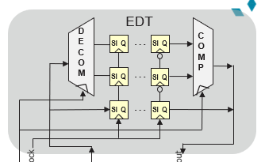
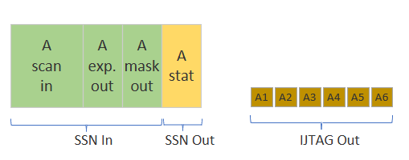
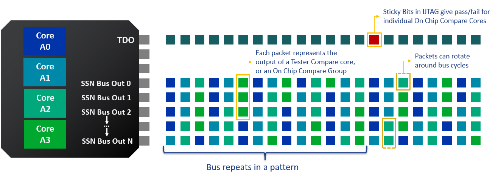
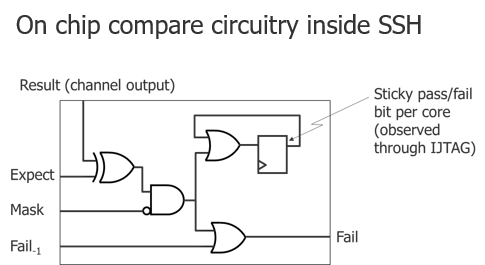
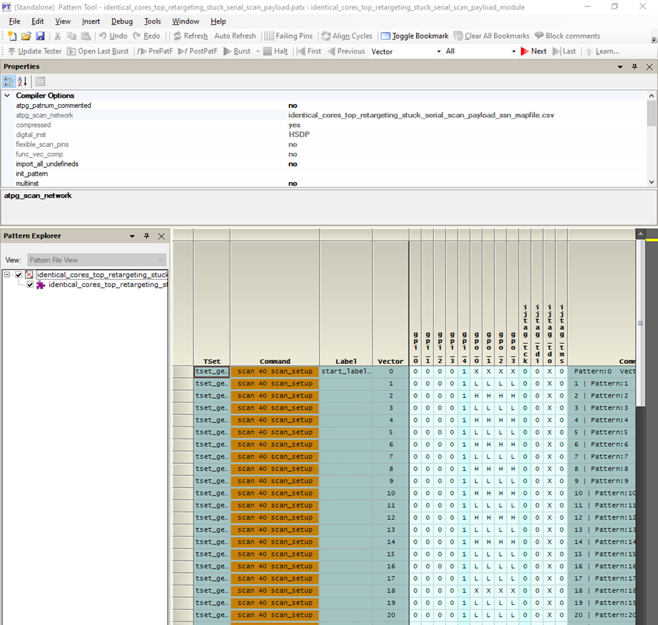
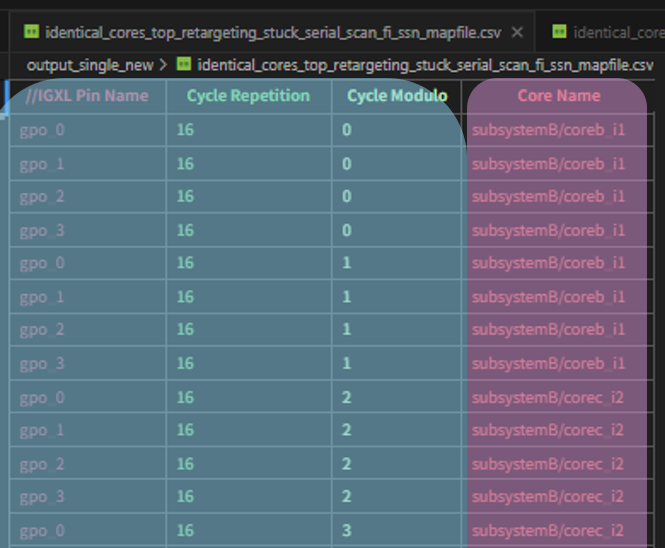
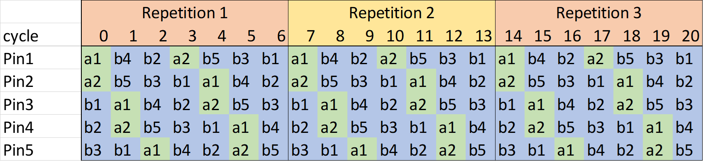
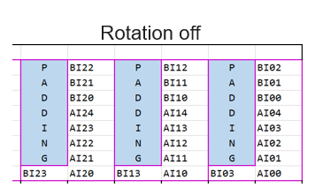

# SSN Slang Glossary

To address the traditional SCAN technology's sustainability pain points, SSN has created a lot of new concepts that does not exist before and a lot of acronyms along with them. The purpose of this cheat sheet is supposed to help users who are new to SSN to understand the slang that we speak.

## Platform agnostic terms

### Accumulated Status

- refer to __[On-Chip Compare](#on-chip-compare-occomp)__
- Per-shift pass/fail status bits accumulated​ across all `ssh_icl_instances` of the same `capture_global_group`

### capture_global_group

- refer to __[representative_ssh](#representative_ssh)__
- `ssh_icl_instances` that share the same `capture_global_group` ID appear as only one `ssh_icl_instance` on the ssn bus.

### Contribution Bits (disable_contribution_bit)

- A RW bit, if asserted (set to 1), that can prevent a `ssh_icl_instance`'s On-Chip compare logic to modify(contribute) the `Accumulated Status` slots.
- refer to __[On-Chip Compare](#on-chip-compare-occomp)__.

### core_instance

- A core is often a function IP with established `EDT` networks.
- It can be assigned with one ssh instance or multiple if the core is too complex.
- you can consider a `core instance` as a group of `ssh_icl_instances`, note that the group may only contains one `ssh_icl_instance`.
- when testing, core instance need to be tested as a minimum unit. which means all `ssh_icl_instances` of a given `core instance` need to be enabled.

### EDT

- Embedded Deterministic Test

### ICL (icl)

- Instrument Connectivity Language

### iJTAG

- IEEE 1687

### On-Chip Clock (OCC)

- this is to highlight that `OCC` is typically referring to __On Chip Clock__, while __[On-Chip Compare](#on-chip-compare-occomp)__ uses `OCComp`

### On-Chip Compare (OCComp)

- A ssh takes its scan in data as well as scan out data (expected and masked) from predictable preallocated `time slot` on the ssn bus and offload the mis-compares on a dedicated region on the preallocated `time slot` called `accumulated status` zone.

- Per-shift pass/fail status bits accumulated​ across `ssh_icl_instances` (SSN stream)
- Sticky pass/fail status bit per `ssh_icl_instances` (IJTAG)

- refer to [Sticky Bits](#sticky-bits-sticky_bit)

### representative_ssh

- when multiple identical `ssh_icl_instances` are tested simultaneously as a group, they can share the same scan in data & scan out expected/mask data. In that case, only one copy of the data is present on the ssn bus and one bucket of `time slots` will be allocated. Siemens use the first appeared `ssh_icl_instance` in that group as the `representative ssh`, whose name will appear in the pin/cycle-to-ssh mapping section, and for the following appeared `ssh_icl_instances` they will have an attribute that points to the first ssh, namely `representative ssh`.
- `representative ssh` represent a group of `ssh_icl_instances` that share the same `capture_global_group` ID with it.
- User can't tell if a `ssh_icl_instance` from the mapping section is a `representative_ssh` or not.
- User need to parse the `Active Ssh Section` to get that information.
  
### SMux

- A Multiplexer on the ssn Bus

### SSH (ssh)

- Streaming Scan Host

### ssh_icl_instance

- an instance of an __[ssh](#ssh-ssh)__, accessed via iJTAG with a unique icl address.
- in most cases the term `ssh instance` and `icl instance` are interchangeable, so it may be referred to as `ssh_icl_instance` in the mapping section of a pattern(stil) file.

### SSN

- Streaming Scan Network

### Sticky Bits (sticky_bit)

- A RO bit, if asserted (set to 1), that marks the failure status of a `ssh_icl_instance`'s On-Chip compare logic since last reset. ( a reset is typically done in `ssn_setup` or `ssn_end`)
- refer to __[On-Chip Compare](#on-chip-compare-occomp)__

### Tester Compare (TC)

- A ssh takes its scan in data from predictable preallocated `time slot` on the ssn bus and offload the EDT's scan out data on the same `time slot`.

- each `time slot` on the ssn bus out will map to a `ssh_icl_instance` (or a group of identical `ssh_icl_instance` that share the same `representative ssh`)

- tester will compare the scan out against the expected and any mis-compare will map to the `ssh_icl_instance`, thus one will know which `ssh_icl_instance` failed and which `core instance` failed.

## Pattern Related

### ssn_setup pattern

- the pattern for setting up the ssn bus and active ssh instances
- it configs all the disable_contribution_bit of active ssh instances
- only the JTAG port is active, the ssn bus is in idle state

### ssn_payload pattern

- the pattern that contains all the streaming scan data
- the scan blocks are packed back-to-back without parallel vectors in between
- JTAG and other control pins are in idle state.
- this type of pattern should contain an attribute called `atpg_scan_network`, it's a reference pointing to the [ssn_mapfile.csv](#_ssn_mapfilecsv)

### ssn_end pattern

- the pattern for resetting the ssn bus and active ssh instances
- it also collect the status of all sticky_bits
- only the JTAG port is active, the ssn bus is in idle state

### *_ssn.csv

- a file that is generated along with the ssn_setup pattern or the ssn_end pattern
- contains the extracted active ssh instances information
- the content is subject to change due to the evolution of ssn
- IG-XL currently(as of 11.0) do NOT parse the file, a code lib provided by Factory Apps will read and parse the file.

### *_ssn_mapfile.csv

- a file that is generated along with the ssn_payload pattern.
- contains the information of pin/cycle-to-core(ssh) mapping
- the content is subject to change due to the evolution of ssn
- IG-XL will parse and load the file while loading the payload pattern.

### cycle_repetition

- fitting a N bit streaming packet data on a M bit wide bus will result in the mapping pattern to repeat every R cycle, where R = LCM(M, N) / M
  - LCM: Least Common Multiple
- it means every R cycles the pin/cycle-to-core(ssh) mapping relation repeats.
  - for each scan out pin, the cycle-to-core(ssh) mapping repeats every R cycles
- we call the R cycle_repetition
- refer to [cycle_modulo](#cycle_modulo)

### cycle_modulo

- refer to [cycle_repetition](#cycle_repetition)
- with the mapping being cycling, a given modulo number on a given pin will constantly map to a fixed core
- the mapping table is constructed with 4 columns being:
  - pin
  - cycle_repetition
  - cycle_modulo
  - core/ssh-icl instance

### rotation

- fitting a N bit streaming packet data on a M bit wide bus will result in the mapping pattern to repeat every R cycle, where R = LCM(M, N) / M
  - LCM: Least Common Multiple
- sometimes user would patch the streaming data so that N is integer multiple of M, this is called rotation = off
- the most efficient way is to disable patching, which is called rotation = on
- refer to [cycle_repetition](#cycle_repetition)
- refer to [cycle_modulo](#cycle_modulo)

### prime_scan_mask (opcode)

- a opCode that is needed for masking core/ssh-icl instance.
- refer to [prime_scan_mask, prime_no_scan_mask](https://myinfo-support.teradyne.com/documentation/r/SCAN-Syntax-Reference/prime_scan_mask-prime_no_scan_mask/IGXL11.00.00)
