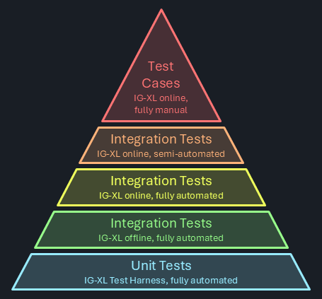
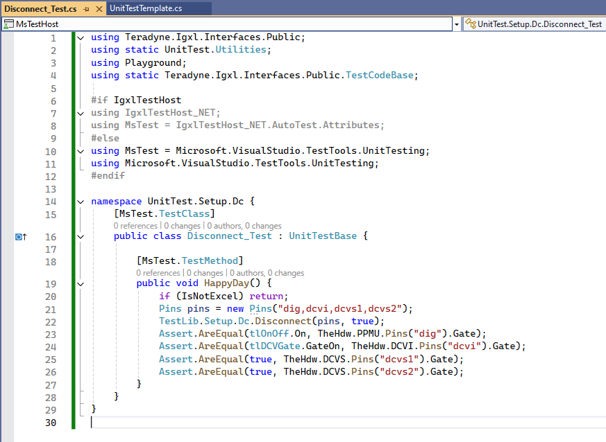

# Unit- & Integration Testing

In today's software development landscape, simply writing code isn't enough to meet customer expectations. Users rightfully demand that software is thoroughly verified before deployment. This mind-shift is driven by ever-increasing complexity and software savvy-ness of almost any product, and ATE systems specifically. 

Without that, a reliable system is hard to achieve.

## Objective

Within the C#RA project, the following goals need to be achieved:

- achieve great coverage (strive for 100%, make trade-offs only where not possible, not if "too much effort")
- provide earliest possible feedback to users
- provide an environment that makes writing and maintaining test efficient
- provide a test case framework that can easily be used to reproduce issues
- reproduce issues found in a unit or integration test before fixing it to confirm the fix is effective and recurrence is prevented

## Test Strategies

Various options exist for software testing, and they come with pro's and con's.



Software testing doesn't come for free. As IG-XL prominently states "weeks of pure test runtime is performed for every build". That's achieved by massive parallelism of test hardware, so that the results are available in ~ 6 hours. Even that means that fails possibly requiring rework are often detected on the next working day, impacting schedule and adding friction when having to multiplex between tasks. The engineering effort to maintain all this is significant.

> [!Note]
> Strictly typed languages (like C#) enable the compiler and the IDE to detect and flag code issues right at design time. That's the fastest and most efficient way to improve quality possible. Type mismatches, calls to non-existent functions, uninitialized objects, ambiguities and to some extent null reference errors are reliably prevented. The likelihood for code to run correctly at the first attempt is significantly improved.
>
> There's always some cost, and proponents of loosely typed languages will cite a longer learning curve and higher efforts instead of "quickly get something done" as downsides. Especially for large projects with a focus on reliability these can be seen as investments that'll quickly reward.
>
> Strictly typed languages help at the foundation of the pyramid by already removing the need for test coverage of many functional aspects of the software - it wouldn't be allowed to build if violated.

### Unit Tests

In the pyramid above, the bottom is considered the preference. Unit testing means a focus on granular functional entities (=units) to be verified independently from a larger context or system where they would be embedded in.

Instead, the code is isolated and any dependencies are simulated. When using IG-XL Test Harness, test code **only thinks** it's talking to IG-XL's public API, but instead it's accessing a simplified copy (=mock) of that with little to no functionality. That makes the tests run faster on machines that don't even need IG-XL (and Excel and Oasis) installed.

By focusing on small & granular code entities (single methods, classes, types), it's easier to reach corner cases that'll utilize the different behaviors and allow comparing against expectations.

> [!Important]
> Try to achieve as much test coverage as possible with unit tests. It's the most efficient option.

#### IG-XL_TestHarness

[IG-XL Test-Harness](https://github.teradyne.com/SEMITEST-Products/IGNET_TestHarness) is a product, which mocks the IG-XL interfaces, so that test methods can be executed within MSTest, and no need to have IG-XL / Excel running or even installed. By simulating IG-XL's functionality, the Test-Harness enables the use of Test Explorer and makes 'dotnet test' functional, providing a seamless integration with the .NET testing tools. 

> Add details how to write unit tests here

### Offline Integration Tests

Certain functionality requires IG-XL to be present, even an offline scenario can be sufficient. Examples are for instance where the mechanics of a test method can't be simulated without changing it.

> Add details how to write offline tests here

### Online Integration Tests

Some verification may require actual tester hardware or device responses. These tests have to be run asynchronously, because tester hardware isn't exclusively available.

The current plan is to have this executed daily on weekdays @ noon China time. The process is mostly automated, but requires a manual kick-off.

> Add information about which can be automatic and which are manual, and how to write them

### Online / Offline Test Cases

Some feature verification can't be executed via automation as it may be interuptive or require system or context changes that are either impossible or very difficult to do. These tests are done in test case workbooks, which users derive from the demo job based on ADU hardware.

Ideally, this category is empty.

> Add details how to create test cases and if & where to maintain.

## Implementation & Execution Matrix

| Test type | Implemented in | Running on / at | Results will |
|---|---|---|---|
| Unit tests using IG-XL Test Harness | XXX project | GitHub cloud runner at every push & pull request | block a merge on fails |
| Offline Integration Tests using IG-XL | YYY project | self hosted runner at every push & pull request | block a merge on fails |
| Online Integration Tests using IG-XL | ZZZ project | tester EV-??? / daily @ noon China time | be emailed? result in issues? |
| Online Integration Tests using IG-XL (semi-auto) | QQQ project | tester EV-??? / daily @ noon China time | be posted in DocFX pages? Manually processed? |
| Online Test cases | local copy of the demo workbook | authors discretion | be manually analyzed and captured as issues if needed |

## Alternatives Considered

### AutoTest / AutoTestPro

[AutoTest](https://github.com/TER-SEMITEST-InnerSource/auto-test-igxl) is an approach, developed as a proof-of-concept where IG-XL takes the lead in executing all the tests. In this setup, IG-XL is responsible for running the test code and logging the results to a log window. This approach does not integrate with MSTest or the Test Explorer, meaning that standard .NET testing tools, such as dotnet test, are not compatible with it. While AutoTest provides a way to execute tests directly within Excel, it lacks the integration with the broader .NET testing ecosystem.

[AutoTestPro](https://github.com/TER-SEMITEST-InnerSource/cs-reference-architecture) is a hybrid solution that combines the strengths of both the AutoTest and Test-Harness approaches. In this method, MSTest is used in conjunction with the Test Explorer to manage and display test results, while also starting and interacting with the Excel process to execute the test code.

This option was selected for the C#RA in it's initial phase as it allows quick coverage ramp with foreseeable efforts, as that model had been used in other, large-scale projects before. After the IG-XL Test Harness product had further matured, the team switched over to that option. Migrating the existing tests was done in a consolidated, but not insignificant effort.

## Transition phase

In the first phase of this project unit-tests were written with the **AutoTestPro** approach. Which was very successful to get the team going. Currently there are ~1000 unit-tests written for the **C#RA** project.

Meanwhile the **Test-Harness** product matured and the C#RA project will be one of the first Teradyne internal projects that will take advantage of it and be a tester of its capability and its use.

Because the previous approach needed a special infrastructure to work and the Test-Harness is much easier to use, a new structure for unit-tests needs to be implemented.

### Architecture

The goal of unit-testing is that we aim 100 % line coverage for all future versions of C#RA. Therefore, we need a structure to easily maintain and extend it.

The **Test Explorer** of Visual Studio, is grouping unit-tests by **Project, Namespace, Class and Method**.

The [code-structure](./code-structure.md) shows that **Test Methods**, **Test Blocks**, **Services**, **Types**, **Extension Methods** are the things that need to be unit-tested. Test Methods and Types do not have a version, but Test Blocks, Services and Extension Methods are versioned.

To show the customer how to write unit-tests with Test-Harness and C#RA a unit-test project called **TestMethods_UT** will be introduced, that project only tackles unit-tests for **Test Methods**. A separate project is needed for **Types** and one project per version **Vx_UT**. All of those project will be placed in the **UT** folder inside of /src.

```
└── 📁UT
    └── 📁TestMethods_UT
        └── 📁Continuity_UT
            └── Parametric_UT.cs
        └── TestMethods_UT.csproj
    └── 📁VersionAgnostic_UT
        └── Pins_UT.cs
        └── VersionAgnostic_UT.csproj
    └── 📁V1_UT
        └── 📁ExtensionMethods_UT
            └── SingleOrAt_UT.cs
        └── 📁Services_UT
            └── AlertService_UT.cs
        └── 📁TheLib_UT
            └── 📁Setup_UT
                └── 📁Dc_UT
                    └── Connect_UT.cs
        └── V1_UT.csproj
```

---

> # Historic Data
>
> ## Problem Statement
> 
> The main issue is that the test code for IG-XL needs to be executed within an Excel process, but [MSTest](https://learn.microsoft.com/en-us/dotnet/core/testing/unit-testing-with-mstest), the testing framework, operates in a separate process. MSTest provides the test explorer to select single, or multiple tests to run, it also displays the results. Both processes are trying to control the execution, which creates a conflict.
> 
> ## Architecture
> 
> The architecture of this solution is designed to handle the complexities of integrating MSTest with Excel for unit testing. It involves multiple projects and shared components to ensure flexibility and efficiency in both single/multiple run and pipeline run workflows.
> 
> ### UnitTestSetup (shared)
> has the Setup TestClass which does the communication between MSTest and IG-XL.
> 
> ### UnitTestBase (shared)
> is the base class for every unit-test class that will be executed by IG-XL.
> 
> ### UnitTestPipeline (shared)
> consists of one method, that will trigger IgxlTestHost to call every method via reflection that is a TestMethod.
> 
> ### UnitTest (shared)
> is where every user will write the unit-tests.
> 
> ### MsTestHostPipeline (MSTest)
> is a MSTest project that will call the single TestMethod from UnitTestPipeline. It imports the UnitTestPipeline, UnitTestBase and UnitTestSetup projects.
> 
> ### MsTestHost (MSTest)
> is a MSTest project that gives you the ability to call each unit-test individually or in groups. It imports the UnitTest, UnitTestBase and UnitTestSetup projects.
> 
> ### IgxlTestHost (IG-XL)
> is an IG-XL project that has the infrastructure to call selected or all unit-test via reflection, depending on different aspects. It imports the UnitTest, UnitTestPipeline and UnitTestBase projects.
> 
> ## Workflow
> 
> In the context of integrating MSTest with Excel for unit testing, two distinct workflows have been developed to address different testing needs and optimize performance: the single/multiple run workflow and the pipeline run workflow. By having both workflows, you can choose the most appropriate method based on the specific requirements and context of your testing, ensuring both efficiency and reliability.
> 
> ### Single/Multiple Run
> 
> In this approach, the IG-XL flow executes a single test. This ensures that each test is executed in a fresh environment, which can be particularly useful for debugging or when running a small number of tests. However, this method introduces overhead, as the IG-XL flow needs to be initialized and terminated multiple times. While this overhead can be acceptable for smaller test sets, it may become inefficient for larger test suites and especially for pipeline runs.
> 
> ```mermaid
> sequenceDiagram
> 
>     loop for every selected test
>         MSTest->>vba: Run(fullyQualifiedTestClassName, testName)
>         vba-->>cs: clear persistent data
>         vba->>cs: Run Test Program
>         cs->>cs: Execute Test
>         cs-->>vba: write persistent data
>         vba->>MSTest: return Pass/Fail
>         MSTest->>vba: GetErrorMessage // only if there was a failed test
>         vba->>MSTest: return ErrorMessage
>     end
>     Box Visual Studio
>     participant MSTest
>     end
>     Box Excel
>     participant vba
>     participant cs
>     end
> ```
> 
> ### Pipeline
> 
> In this approach, the IG-XL flow is started once at the beginning of the test run and remains active throughout the entire testing session. All tests are executed within this single instance of IG-XL, and the results are collected and returned to MSTest at the end. By reducing the overhead to a one-time cost, this workflow significantly improves efficiency, making it ideal for running a large number of tests or for automated testing environments.
> 
> ```mermaid
> sequenceDiagram
> 
>     MSTest->>vba: Run(fullyQualifiedTestClassName, testName)
>     vba-->>cs: clear persistent data
>     vba->>cs: Run Test Program
>     loop Reflection
>         cs->>cs: Execute Test
>     end
>     cs-->>vba: write persistent data
>     vba->>MSTest: return Pass/Fail
>     MSTest->>vba: GetTotalTests
>     vba->>MSTest: return TotalTests
>     MSTest->>vba: GetFailedTests
>     vba->>MSTest: return FailedTests
>     MSTest->>vba: GetErrorMessage // only if there was a failed test
>     vba->>MSTest: return ErrorMessage
>     Box Visual Studio
>     participant MSTest
>     end
>     Box Excel
>     participant vba
>     participant cs
>     end
> ```
> ## Use-Model
> 
> To utilize this architecture, users only need to focus on writing their unit tests within the UnitTest shared project. The process is straightforward and user-friendly:
> 
> ### Locate the Template Class
> 
> In the UnitTest shared project, there is a template class provided with simple test cases.
> 
> 
> 
> 
> 
> ### Copy and Paste
> 
> Users can copy and paste the entire template class into their own test file (e.g. 'Disconnect_Test.cs'). The file name should be the method name that you want to test with a specified postfix of '_Test'.
> 
> 
> 
> Change the namespace according to the hierarchy of the method you want to test. (e.g. 'TestLib.Setup.Dc.Disconnect()'). Also change the class name to match the file name (e.g. 'Disconnect_Test.cs').
> 
> 
> 
> 
> ### Customize
> 
> Modify the copied template to suit your specific testing needs. Add or change test methods, inputs, and expected outcomes as required.
> 
> 
> 
> This approach simplifies the process of writing unit tests, ensuring that users can quickly get started without needing to understand the underlying complexities of the architecture. By following these steps, users can efficiently create and manage their unit tests, leveraging the robust framework provided by the architecture.
> 
> ## Performance
> 
> To ensure the robustness and efficiency of the architecture, extensive stress testing was conducted with varying sizes of unit tests. The tests included sets of 1k, 5k, 10k, 20k, 30k, 50k and 115k unit tests. The results demonstrated that the architecture could handle large volumes of tests efficiently.
> 
> There was a consistent overhead of approximately 300 seconds, regardless of the number of tests. This overhead is associated with the initialization and management of IG-XL.
> 
> The total execution time scales linearly with the test count. In this case, ~10ms were consumed per test, which can be considered to have realistic & representative complexity.
> 
> 
