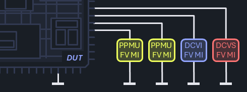

##### Test Technique

This test method can be used to measure currents flowing into the inputs of a device, additionally running a pattern before the measurements to precondition the device under test (DUT) and ensure that the pins or internal circuits are in the correct state for testing. One common example is the digital input leakage test to detect issues in isolation structures, possibly damaged by a manufacturing flaw or elevated test voltage levels. Even though such a device may still work according to the specification, statistical outliers can indicate early failures in the devices' target application.

A typical circuitry for a leakage test showing the device and four instruments (three different types) connected to individual device pins. The instruments are ground referenced and in Force-Voltage mode to allow measuring the currents flowing into the device.

The test typically applies a voltage near the VDD level to digital input pins, after the device has been brought into a static state that should not allow any current to flow. Ideally, the measured currents are very close to 0A. High sensitivity to noise, and the need to settle dynamic (charging) effects often result in significant test times, mitigated only by the fact that the measurement can usually be made on all pins in parallel.

The serial testing method is distinguished by a high degree of precision, as it allows for the individual evaluation of each pin, thereby contributing to the efficient identification of leakage currents and a detailed analysis of the behavior of each tested element. It is also ideal in cases where resources are shared. However, a significant limitation of this method lies in the longer testing time, since the evaluation is performed sequentially, pin by pin. In such situations, it is recommended to resort to the parallel testing method, which enables faster testing and more efficient use of available resources.
Details can be found in: [Leakage.Parallel.Preconditioning](xref:Demo_CSRA.Leakage.Parallel.Preconditioning(Teradyne.Igxl.Interfaces.Public.Pattern,Teradyne.Igxl.Interfaces.Public.PinList,System.Double,System.Double,System.Double,System.String))

Alternatively, the group testing method offers a balance between precision and efficiency by performing sequential testing of pins or groups of pins, according to the structure defined in the `pinList`.
Details can be found in: [Leakage.Groups.Preconditioning](xref:Demo_CSRA.Leakage.Groups.Preconditioning(Teradyne.Igxl.Interfaces.Public.Pattern,Teradyne.Igxl.Interfaces.Public.PinList,System.Double,System.Double,System.Double,System.Double,System.String))

Special attention is required to avoid these common issues:

- An accidental disconnect in the signal path (e.g., due to an open DIB relay) may be difficult to detect, as measurements into an open line yield statistically inconspicuous results.
- The measurement of very small currents may be limited by the instrument's performance, so that the results rather reflect the instrument's behavior instead of the component's characteristic.

##### Implementation

The **Validation** section instantiates the pins object and will also instantiate the pattern object if a pattern is given in the test method parameters.

The **PreBody** section applies levels and timing from the test instance context. Optionally, applies the specified `setup`. Executes the `pattern` if passed in the test method parameters and for all pins specified in the `pinList` it disconnects any pin electronics, connects the dc path.

The **Body** section initially applies the `baseVoltage` and turns on the gate to all pins. Subsequently, regardless of whether a group of pins or multiple groups are specified, the process proceeds sequentially, pin by pin. For each individual pin, the `voltage` is applied, the specified `waitTime` is allowed to elapse, and a current measurement is performed. After the measurement is completed, the `baseVoltage` is reapplied to the respective pin.

The **PostBody** section establishes the pin electronics connection for digital pins after gating off and disconnecting the DC path. Finally, a parametric datalog is logged.

##### Platform Specifics

Supports stepping capability for PreBody/Body/PostBody.

##### Pre Conditions

- none

##### Post Conditions

- digital pins in `pinList` have pin electronics connected
- any dc paths from pins in `pinList` are disconnected

##### Limitations

- none

##### Code Reference

[!code-csharp]
